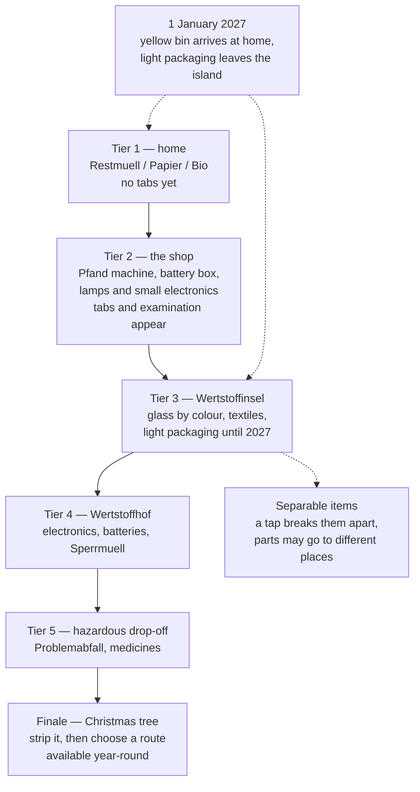
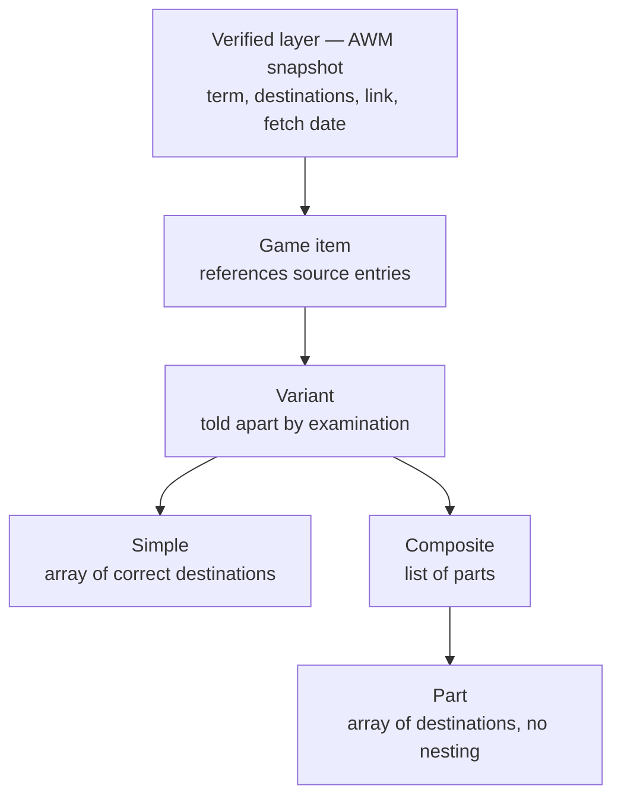

# Munich Waste Sorting Game - Specification

A casual mobile-web game that teaches newcomers to Munich where household waste actually goes.

This is the requirements document: what the product must do and why, not how it is built. Requirement IDs match the Russian edition in `docs/plans/` one-for-one — edit both or neither.

## Goal Capsule

- **Objective.** A mobile-web game that teaches people arriving in Munich not *which bin* but *where to carry it*, and keeps teaching it correctly through the city's Gelbe Tonne switch on 1 January 2027 — the moment the whole city has to relearn the answer.
- **Product authority.** This document covers the autumn 2026 release and the January 2027 release as one product. The act of publishing is inside the first release; partnership with AWM and other-city editions are not.
- **Open blockers.** Two, both under Resolve Before Planning: how many items the author is willing to verify by hand before the target date, and which Munich entry points the launch publishes to.

---

## Product Contract

### Summary

A mobile-web game where waste falls from the top and one continuous belt of containers sits at the bottom, grouped by *place*: home, the shop, the Wertstoffinsel, the Wertstoffhof, hazardous drop-off. The player swipes along the belt, or jumps to a group by tapping its place tab. Places unlock one at a time, mirroring how the city is actually organised. The game ends with a Christmas tree — the one item whose correct answer is not a container at all. On 1 January 2027 the yellow bin arrives at home and light packaging leaves the island, as a data change rather than a code change.

### Problem Frame

Munich does not work like the rest of Germany, and some of those differences will outlive 2027 while others will not. The durable ones: glass and textiles go to public Wertstoffinseln rather than being collected from the building; of the three bins at home only Restmüll is charged; bulky waste, electronics and hazardous materials go through Wertstoffhöfe; the Gelber Sack never arrives here at all.

**The hard part is not which bin.** Four bins are learnable in an evening. What is not learnable in an evening is that waste has a *place*: some goes downstairs, some back to the shop you bought it from, some to an island, some driven to a Wertstoffhof, some handed over separately — and a Christmas tree goes to a designated collection site. The shop is the least obvious of these and the most useful: German law obliges any retailer selling batteries to take them back, and any shop above a size threshold to accept old lamps and small electronics under 25 cm — no purchase required. Newcomers drive across town to a Wertstoffhof for a charger they could have dropped off while buying milk. Someone whose previous city collected everything from the building gets it wrong at the level of place, not container, and nobody explains this coherently: AWM explains per item, while a newcomer needs it per place.

**The second layer: the answer is written on the object, not derivable from its name.** A bottle labelled `Pfand` goes back to a machine; a visually identical one labelled `Pfandfrei` does not — and the word contains "Pfand", which is exactly how people get caught. The wrapper around a tea bag may be plain paper or foil-lined, and the bag itself may be cellulose or a synthetic non-woven, which decides whether it may go into Bio. These objects have to be examined, not recognised.

**The third layer: boundaries inside a category you think you know.** A supermarket receipt feels like paper and is not — thermal paper belongs in Restmüll, and examination does not help, because a phenol-free receipt is indistinguishable from the rest. A pizza box is two answers, not one: clean cardboard to Papier, food residue to Bio. A tea bag is four — wrapper, bag, string with staple, paper tag. A yoghurt pot's components separate not across bins but across places.

**The fourth layer: a widespread misconception about penalties.** In Bavaria a household sorting mistake is worth around €20, and in practice the consequence is different anyway — a contaminated bin is emptied as Restmüll and billed. Real fines attach to illegal dumping — but even there several routes are usually correct, and a game that names one of them as *the* answer errs against the player.

**The fifth layer: time.** On 1 January 2027 the city introduces the Gelbe Tonne, bins are distributed from November 2026, and the light-packaging containers leave the Wertstoffinseln. The whole city has to relearn, and what changes is the place.

### Key Decisions

- KD1. **Teaching outranks gamification.** Where entertainment and learning pull apart, learning wins: the game mechanics exist to hold attention on a dull subject, not the other way round. Governs R8, R9, R10.
- KD2. **Falling waste and a swipeable container belt** (session-settled: user-directed — chosen over a Wordle-style daily: a ladder of places teaches how the system is built, a flat list of items does not). Governs R1, R6.
- KD3. **One continuous belt, with containers grouped by place** (session-settled: user-directed — chosen over tabs as a mode switch: swapping the belt's contents costs the player their bearings under a falling item, whereas a continuous strip travels and keeps them. As a side effect, how far you swipe to reach a distant place is itself the metaphor for how far you have to carry things). Governs R1, R2, R6.
- KD4. **Place tabs jump along the belt rather than switching a mode; examining and splitting are a tap on the item** (session-settled: user-approved — chosen over a vertical swipe and a pinch: both collide with mobile-web browser gestures and a pinch is impossible with one thumb. The tabs stay permanently visible and teach the structure of places by being there). Governs R2, R4, R5.
- KD5. **A single finale — the Christmas tree** (session-settled: user-directed — chosen over pairing it with an Oktoberfest finale: returning reusable tableware at the Wiesn is not a decision a visitor faces, and an event ground is not one of the places in the model). Governs R7.
- KD6. **Fall speed depends on the item, and dropping early is rewarded.** Time becomes a resource spent only on doubt, and the score measures not recall but knowing what you know. Governs R3, R10.
- KD7. **Data is split into a verified layer and an authored layer.** The verified layer comes from AWM and is diffed automatically; the authored layer is the hand-picked game items that reference it. Without the split the diff is decorative and the content is unprovable. Governs R13, R14, R15.
- KD8. **Rules, the set of places and the contents of each place live as data, separate from game logic.** It is the only way to survive 1 January 2027 without a rewrite — and that switch moves a container between places rather than merely changing addresses. Governs R13, R18, R21.
- KD9. **Architectural generality never surfaces in the product** (session-settled: user-approved — chosen over an explicit city picker: generic things do not get forwarded to friends). Governs R13.
- KD10. **German and English at launch; Ukrainian and Turkish in a later language beat** (session-settled: user-directed — chosen over all four at once: proofreading Turkish and Ukrainian needs native speakers, which is an external dependency on the critical path). Governs R21.
- KD11. **The game neither inflates penalties nor narrows correct routes.** A false threat of a fine on a correct answer destroys trust faster than any other error. Governs R7, R17.
- KD12. **Accessibility never relies on colour.** Glass sorted by colour is the one place in the system where colour carries the address, and green-versus-brown is the pair colour-blind players distinguish worst. Governs R12.
- KD13. **The mandatory legal minimum is unconditionally in the release; analytics is not.** Publishing without an Impressum and a Datenschutzerklärung is unlawful whether or not anything is measured; analytics, by contrast, is the only release obligation with an external counterparty and the first candidate to defer. Governs R25, R26.
- KD14. **Stale seasonal data is shown with its date rather than hidden.** AWM's seasonal pages are not published year-round, and silence is worse than an honest label. Governs R16.

### Requirements

**Core gameplay**

- R1. Items fall from the top; a horizontal belt of containers sits at the bottom; the player brings the right container under the falling item.
- R2. Every unlocked container sits in one continuous belt, grouped by place: home, the shop, Wertstoffinsel, Wertstoffhof, hazardous drop-off. The shop holds the deposit-return machine, the battery box and the take-back point for lamps and small electronics — one building, three destinations. Each group carries a visible divider and label, and the screen shows a window of a few containers rather than the whole belt. Two controls act on that same belt: swiping moves container by container — fine aim; tapping a place tab scrolls to the start of that group — coarse aim. The scroll is animated, so the belt travels rather than swapping content and the player keeps their bearings under a falling item. The tab row is permanently visible, lists every unlocked place, and sits directly above the belt in the lower third of the screen, clear of the fall area. On a keyboard: left and right arrows move the belt, Tab and Shift+Tab jump one place, a digit jumps straight to the place with that number. The arrows move the belt rather than a selection: there is no visible cursor, the aim frame is fixed, and the key must agree in direction with the swipe.
- R3. An item may carry the attribute *borderline*: it falls noticeably slower and is visually marked. An item whose correct place differs from the active one falls slower regardless — changing place costs an extra action against the timer.
- R4. An item may carry the attribute *requires examination*: its correct destination is determined by what is written or visible on the object rather than by its name. In flight the label is deliberately illegible; a tap halts the fall and shows it large and readable. Examining costs time; it is not a hint.
- R5. An item may carry the attribute *separable*, independent of the previous two: it cannot be sent anywhere whole. A tap breaks it into parts, each sorted separately, and parts may go to containers in different places. The order in which parts are sorted does not matter.
- R6. The game grows across five tiers, each introducing one new place, ordered from frequent-and-near to rare-and-far: home → the shop → Wertstoffinsel → Wertstoffhof → hazardous drop-off. Tier one holds only home and shows no tab row; the tabs appear together with the second place. Previously unlocked places remain available.
- R7. After the fifth tier the player reaches the Christmas tree finale: strip the tree, then choose a disposal route. Route is its own data dimension — each has its own availability window or a year-round flag, its own rule for preparing the tree, and its own limits. Every currently valid route counts as correct; illegal dumping is shown only for a location outside all of them. The finale is available year-round.
- R8. After every answer the game shows an explanation before continuing: the correct destination and the reason. When the mistake was the place rather than the container, the explanation addresses the place. When several destinations are correct, the explanation names the others even if the answer was right.
- R9. A separable item is scored per part: a correctly placed part counts, an incorrect one is explained. Taking an item apart never scores lower than sending the same item whole.
- R10. The player may drop an item early and scores more for it. A wrong early drop costs more than an ordinary mistake. Skipping an explanation is allowed but never rewarded: speed affects the score only up to the answer.
- R11. A wrong answer does not block progress: a tier is cleared on a share of correct answers rather than requiring a clean run.
- R12. Colour is never the sole carrier of meaning. A non-colour signal is required for containers, for marking borderline items, and for falling items whose correct destination is determined by colour — glass above all.

**Data and correctness**

- R13. Data is split into two layers. The *verified* layer is a snapshot of AWM entries: term, destinations, source link, fetch date. The *authored* layer is the hand-picked game items, each referencing entries in the verified layer. Sorting rules, the set of places and the contents of each place are stored separately from game logic; city is a parameter in the data and never a choice in the interface.
- R14. A game item is modelled as: item → variants → each variant is either *simple*, with an array of correct destinations, or *composite*, with a list of parts each carrying its own array of destinations. Nesting is forbidden: a part has neither variants nor parts of its own. An object that would need two levels becomes two game items. No destination is ever stored as a copy — it is derived from a reference into the verified layer.
- R15. An item enters the game only after a human has opened and read its source entry; the data keeps a manual-verification flag with a date. Automated checking confirms that declared destinations have not drifted from the source, but it does not replace reading. Content without manual verification is excluded from the build.
- R16. When the current edition of seasonal data has not been published yet, the game uses the last verified edition, states its year and verification date, and points the player to AWM for the current list. Hiding content because a fresh edition is missing is not acceptable; passing stale data off as current is not acceptable either.
- R17. The game mentions monetary consequences only where they are real, and distinguishes a household sorting mistake from illegal dumping.

**Gelbe Tonne transition**

- R18. On 1 January 2027 the yellow bin appears among the containers of the place *home*, and the light-packaging container disappears from *Wertstoffinsel*, where glass and textiles remain; items whose destination changed are scored by the new rule. All of it happens as a data change, with no edit to game logic.
- R19. Throughout the transition period the game shows a message at the start of every session: that the rules have changed, which items moved, and what to do until the yellow bin arrives in the courtyard. The message reads without knowledge of the old rules — it states the current rule first, then what changed into what. No record of having shown it is stored on the device.
- R20. The game's introductory text is updated together with the rules: a description of the city's system must not outlive the change it describes.

**Localisation and legibility**

- R21. Interface strings and rule content are separate; adding a language requires no code change. The first release ships German and English.
- R22. Interface labels — place tabs, container names, explanations — are legible on a phone held at arm's length. This constraint is verified together with localisation: long German place names and a minimum type size compete for the same screen width. It does not apply to the labels on items under R4, whose illegibility in flight is deliberate.

**Reach, legal minimum, observability**

- R23. A completed run produces a result that can be forwarded in one action without registration; the result carries no identifier of sender, session or device.
- R24. The first release counts as shipped only after it has been published to a named list of Munich entry points. Each point is published as its own link carrying a source tag; for moderated channels, publication counts on submission rather than approval.
- R25. Events collected: reach per tier, errors per item distinguishing place errors from container errors, share of early drops and error rate among them, referral source, finale completion, and invocation of the forward action. Client code stores nothing on the player's device and reads nothing already stored — no cookie, no localStorage, sessionStorage or IndexedDB, no fingerprint derived from device or browser characteristics; only what the browser sends in the request itself is collected, and the IP is truncated on receipt. The processor is EU-based under a data-processing agreement. Referral source comes from the tag in R24 with referrer domain as fallback; neither the tag nor the forward event carries a player, session or device identifier, and the act of forwarding is never linked to the act of opening. Raw events are retained no longer than 90 days; aggregates indefinitely.
- R26. The product publishes a Datenschutzerklärung and an Impressum reachable from any screen. The privacy notice is no narrower than Art. 13 GDPR requires — controller and contact, purposes and legal basis, categories of recipients, retention period, data-subject rights and the right to lodge a complaint — and on top of that minimum it names the concrete event list and the retention period from R25.

### Progression ladder

### Data model

Worked example: a pizza box is one item with two variants. Clean is a simple variant with Papier as its destination. With residue it is composite, parts "cardboard" and "residue", destinations Papier and Bio. Which of the two the player is holding is visible only on examination.

### Key Flows

- F1. Ordinary tier
  - **Trigger:** the player opens a tier.
  - **Steps:** items fall one at a time; the player taps the tab of the right place if needed, then swipes the belt; they may drop early for points; an explanation follows each landing.
  - **Outcome:** the tier is scored on the share of correct answers, and a new place unlocks alongside the existing ones.
  - **Covers R1, R2, R3, R6, R8, R10, R11, R12.**

- F2. Examination
  - **Trigger:** an item carrying *requires examination* falls.
  - **Steps:** the player taps; the fall halts and the label or material is shown large; the player returns to sorting.
  - **Outcome:** the variant is identified; ordinary sorting follows.
  - **Covers R4.**

- F3. Taking an item apart
  - **Trigger:** an item carrying *separable* falls.
  - **Steps:** the player taps and the item breaks into parts; each part is sorted separately, changing place where needed.
  - **Outcome:** scored per part; incorrect parts are explained.
  - **Covers R2, R5, R9.**

- F4. Christmas tree finale
  - **Trigger:** the fifth tier is cleared.
  - **Steps:** the player strips decorations, stand and plastic from the tree; chooses a disposal route; satisfies that route's conditions. If the current list of sites is unpublished, the game shows the last verified one with its year and a link to AWM.
  - **Outcome:** the run is complete; the result is ready to forward.
  - **Covers R7, R16, R17, R23.**

- F5. Migration on 1 January 2027
  - **Trigger:** 1 January 2027 arrives.
  - **Steps:** rule data switches to the new edition; the yellow bin arrives at home and light packaging leaves the island; the introductory text updates; through the transition period a change message opens every session.
  - **Outcome:** the game runs on the new rules with the new set of places, with no edit to game logic.
  - **Covers R13, R18, R19, R20.**

- F6. Content reverification
  - **Trigger:** a scheduled snapshot run, or news of a rule change.
  - **Steps:** a fresh AWM snapshot is fetched and diffed against the previous one; changed entries become a reverification list; a human opens the source, confirms or corrects the game item, and updates the manual-verification date.
  - **Outcome:** no item in the game contradicts its source.
  - **Covers R13, R15.**

### Acceptance Examples

- AE1. **Covers R2, R3, R8.** Given: in tier three the active place is *home* and a glass bottle falls. Then the bottle falls slower because its place differs from the active one, and the Wertstoffinsel tab is on screen throughout; when the player sends the bottle into a home container it counts as wrong, and the explanation addresses the place rather than the bin.
- AE2. **Covers R4, R14.** Given: two visually identical bottles fall, one labelled `Mehrweg · Pfand` in small type, the other `Pfandfrei`. In flight the label is illegible; a tap shows it large. The first goes to the deposit-return machine at the shop, the second by material to the Wertstoffinsel. An answer given without examining is scored normally, but the explanation names what distinguished the variants.
- AE15. **Covers R2, R8.** Given: a used phone charger falls. Both the shop and the Wertstoffhof are correct — shops above the size threshold accept small electronics under 25 cm without a purchase. Whichever the player picks counts, and the explanation names the other, because the point of this item is that the drive across town was never necessary.
- AE3. **Covers R4, R5, R14.** Given: a pizza box falls. Examination reveals whether it has residue. A clean one goes whole into Papier. One with residue is tapped apart — cardboard to Papier, residue to Bio.
- AE4. **Covers R2, R5, R9.** Given: a yoghurt pot with a foil lid and a paper sleeve falls. Taking it fully apart requires changing place: the sleeve to Papier at home, pot and foil to light packaging at the Wertstoffinsel. When the player places the sleeve correctly and the pot wrongly, the correct part counts and the wrong one is explained.
- AE5. **Covers R8.** Given: an item falls whose source lists several correct destinations — say Wertstoffhof, Restmüll and bulky-waste collection. When the player picks any of them the answer is correct, and the explanation still names the others.
- AE6. **Covers R10.** Given: the player drops an item early. A correct answer scores more than one given at ordinary pace; a wrong one costs more than an ordinary mistake. Dismissing the explanation quickly does not affect the score.
- AE7. **Covers R7, R17.** Given: the player chooses a disposal route in the finale. Taking a shredded tree to a Wertstoffhof is correct regardless of date. Taking a whole tree to a designated Sammelstelle within its window is correct. Leaving the tree outside every valid route makes the game state that this is illegal dumping and name the real fine.
- AE8. **Covers R16.** Given: the player reaches the finale in July, when AWM's seasonal page is not published. Then the game shows last season's list of sites, states its year and verification date, and links to AWM.
- AE9. **Covers R15.** Given: an item appears in the data without a manual-verification flag. Then the build excludes it and the build process reports which item was excluded and why.
- AE10. **Covers R18, R19.** Given: the player opens the game during the transition period after 1 January 2027. Then the session opens with a message stating the current rule first, then what changed into what, and what to do until the bin arrives; the yellow bin is at home and light packaging is gone from the island. Opening a new session shows the message again.
- AE11. **Covers R12, R22.** Given: a colour-blind player holds the phone at arm's length. Then both the glass containers and the falling bottles are distinguishable by a non-colour signal, and tab and container labels are readable without zooming.
- AE12. **Covers R21.** Given: a third language is added. Then only text and rule-data files change; the game-logic build is untouched.
- AE13. **Covers R24.** Given: the game has been published to the list of entry points. Then every published link carries its own source tag, and for a moderated channel publication counted at the moment of submission.
- AE14. **Covers R25, R26.** Given: the player completes a run and forwards the result. Then nothing is stored on the device; the forward event is recorded as an aggregate counter with no identifier; the Datenschutzerklärung and Impressum open from any screen, and the event list in the notice matches the list in R25.

### Success Criteria

- The public launch happened inside the Oktoberfest 2026 window: 19 September is the target date, 4 October the outer edge of the attention window.
- The game keeps working after 1 January 2027 with no edit to game logic when the rules switch and a container moves between places.
- The switch is documented publicly, so players and contributors can see exactly what changed and when: before and after are visible in screenshots of *home* and *Wertstoffinsel*.
- Reach is measurable: inbound referrals distinguishable by entry point, share of players who finish, share who forward the result.
- Every game item traces to an AWM entry and carries a manual-verification flag with a date.
- The share of early drops among correct answers rises from a player's first run to their second — the signal that they have started knowing rather than guessing.

### Scope Boundaries

**Deferred for later**

- A Wordle-style daily item as a distribution channel.
- Ukrainian and Turkish.
- Coverage beyond five places and one finale.
- A separate practice mode for separable items outside a normal run.
- Additional finales.
- A map with real coordinates of islands and Wertstoffhöfe: the data exists on the city's open-data portal, but places stay abstract in the first release.

**Outside this product's identity**

- Accounts, leaderboards, monetisation.
- One flat belt holding every container: place is part of the answer, not a layout detail.
- A mirror of the Abfalllexikon: the game runs on a curated set, while the full snapshot serves verification and material discovery. AWM already publishes a reference and theirs is better.
- An Oktoberfest finale: returning reusable tableware is not a decision a Wiesn visitor faces, and an event ground is not one of the places in the model.
- An explicit city picker: parameterisation lives in the data; from the outside this is a product about Munich.
- Measuring an individual player's learning outcome: there are no pre/post tests, and product success is measured by reach. That is about *measurement*, not *design* — where mechanics conflict, learning wins, per KD1.

### Dependencies / Assumptions

- Shop take-back rests on federal law rather than on AWM, so it needs its own source: the Batteriegesetz obliges every retailer selling batteries to accept them back free of charge, and the ElektroG obliges retailers above a sales-floor threshold — 400 m² generally, 800 m² for food retailers selling electrical goods — to accept old lamps and small electronics up to 25 cm without a purchase. These are the two rules behind the shop as a place, and they are verified against legislation, not against the Abfalllexikon.
- AWM remains a publicly available source of truth. The Abfalllexikon index page is served without JavaScript and holds roughly 700–1000 entries of the form "term → destinations"; some entries have their own detail pages.
- The Abfalllexikon is a database, and databases enjoy separate protection in Germany (§87a UrhG): individual facts are not protected, systematic extraction of a substantial part may be. The snapshot stores classification and links rather than AWM's prose. Asking AWM for permission before wide publication is worth doing on its own merits — it is also the first contact with an organisation that could amplify the result.
- The Christmas tree has several disposal routes. 2026 edition: Wertstoffhöfe accept up to 20 shredded trees free of charge year-round and are named the first address; open Sammelstellen accept a whole stripped tree from 7 January to 4 February; collection arranged by a building manager is chargeable and runs 19 January to 27 February on request.
- AWM's seasonal tree page is published only in season, so the first release ships the 2026 edition labelled per R16, and the next edition is verified in December 2026.
- The Gelbe Tonne arrives on 1 January 2027 as announced. Bins are distributed in waves from November 2026, outer districts before dense central blocks, and the yellow bin is not mandatory.
- AWM will publish the final list of items whose place changes before December 2026. The mechanism in R18 does not depend on that list.
- Native Ukrainian and Turkish proofreaders are available by December 2026; otherwise the language beat slips. This does not affect the January release.
- An Impressum under §5 DDG requires a ladungsfähige Anschrift; a PO box does not qualify. The address is chosen and arranged in advance so it never blocks publication.
- **Implementation is expected to be delegated to an agent, which makes content — not code — the project's binding constraint.** Mechanics, layout, data layers and localisation delegate well. Verifying each item against AWM does not delegate at all: an agent will confidently invent a sorting rule, and municipal accuracy is the only thing separating this product from a dozen existing ones. R15 exists precisely as that barrier. Tuning feel — fall speeds, the weight of an early drop, the reward curve — also stays with a human: it is dialled in by playing, not by specifying.
- A spike covering the first two places has been built and played: the loop holds attention, the continuous belt with place tabs works one-handed, and the fall speeds and reward numbers were set arbitrarily and need tuning. It lives at `prototype/spike-belt.html`.

## Contributing

The most valuable contribution is not code. It is a verified item: a waste item newcomers get wrong, with a link to its AWM entry and the date you read it. R15 is the rule that keeps this product honest — nothing enters the game on the strength of someone being fairly sure.

Corrections to existing items are equally welcome, especially with a source link. Munich's rules change, and this document exists partly because one of those changes lands on 1 January 2027.

### Outstanding Questions

**Resolve Before Planning**

- How many game items the author is willing to verify by hand before the target date. This, not build speed, decides whether 19 September is reachable: mechanics delegate, reading sources does not. The number determines both the content volume and how many tiers make the first release.
- Which Munich entry points make up the list in R24. The requirement makes publication a condition of shipping, but no channels are named, and both moderation lag and the source tags in R25 depend on them.

**Deferred to Planning**

- Which tier is cut first if scope overruns: a priority order within the requirements.
- Whether a place error is its own error type in scoring, or equivalent to a container error.
- How much more a wrong early drop costs and how much more a correct one is worth — the numbers of the reward curve.
- How many containers fit in the belt's visible window on a phone so that neighbouring groups stay discernible while labels stay legible at minimum type size.
- How places and containers are identified visually — icon, label or both — at minimum type size across four languages.
- Technical stack and storage format for the authored data layer.
- The form of the forwarded result, and whether it creates a server-side record of an individual forward.
- Which EU analytics processor is chosen, and confirmation that its client code reads nothing about the browser beyond what the request already carries.
- Who acts as the GDPR controller — the author as a natural person, or a legal entity.
- How the start and end of the transition period are determined, and against which time source.
- How often the reverification run in F6 fires, and who triggers it.

### Sources / Research

- AWM Abfalllexikon — per-item source of truth: `https://www.awm-muenchen.de/abfall-entsorgen/abfalllexikon`
- How Munich's system works, the three bins and the Wertstoffinseln: `https://www.awm-muenchen.de/entsorgen/das-muenchner-muellsystem`
- The Gelbe Tonne project, timing and parameters: `https://www.awm-muenchen.de/unternehmen/projekte/gelbe-tonne`
- Gelbe Tonne FAQ, including replacement of the Wertstoffinsel containers and the bin being optional: `https://www.awm-muenchen.de/unternehmen/projekte/gelbe-tonne/faq-gelbe-tonne`
- The 2027 introduction decision: `https://ru.muenchen.de/2026/85/Einfuehrung-der-Gelben-Tonne-nimmt-naechste-Huerde-124132`
- Christmas tree disposal routes, sites and windows: `https://www.awm-muenchen.de/abfall-entsorgen/abgabestellen/christbaumentsorgung`
- Wertstoffinseln and Wertstoffhöfe as open datasets with coordinates: `https://opendata.muenchen.de/dataset/awm_container_opendata` and `https://opendata.muenchen.de/dataset/awm_wertstoffhoefe_opendata`
- Fine ranges in waste management: `https://www.bussgeld-info.de/muell-muellentsorgung/`
- Competitive field of waste-sorting games: #wirfuerbio Sortierspiel, Die Müll AG (Karlsruhe), browser sorting games on plays.org — all aimed at children and at a generic Germany, with no city specificity.
- Spike, first two places on the continuous belt: `prototype/spike-belt.html`
- Lexicon snapshot and diff tool: `tools/awm_lexikon.py`
