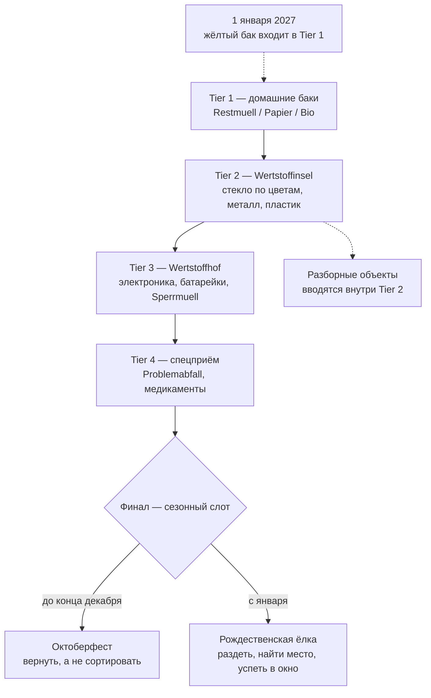

# Munich Waste Sorting Game - Plan

## Goal Capsule

- **Цель.** Мобильная веб-игра, которая учит сортировке мусора в Мюнхене через растущую ленту контейнеров, и одновременно служит публичным портфолио-артефактом: постановка задачи, архитектурное решение, UX/UI, вывод в продакшен и сопровождение через смену предметной области 1 января 2027.
- **Продуктовая ответственность.** Документ описывает первый релиз (осень 2026) и второй такт (январь 2027) как один связный продукт. Каналы дистрибуции, партнёрство с AWM и версии для других городов — вне активного объёма.
- **Открытые блокеры.** Нет. Неопубликованный перечень предметов, меняющих адрес при вводе Gelbe Tonne, ведётся как внешняя зависимость по данным, а не как блокер планирования.

---

## Product Contract

### Summary

Мобильная веб-игра, где мусор падает сверху, а снизу лента контейнеров, которую игрок свайпом подводит под предмет. Контейнеры добавляются по мере прохождения, повторяя реальную структуру мюнхенской системы. Финал меняется по сезону: до конца декабря — Октоберфест, с января — рождественская ёлка. 1 января 2027 в ленте появляется жёлтый бак, и часть предметов меняет адрес — изменением данных, не кода.

### Problem Frame

Мюнхен — исключение в немецкой системе обращения с отходами. Дома стоят три бака: Restmüll, Papier, Bio, причём платный только первый. Упаковка не забирается от дома: её носят на 900+ Wertstoffinseln. Всё остальное — на Wertstoffhöfe и в спецприём. Приезжий, у которого в прошлом городе был жёлтый мешок, приходит сюда с готовой и неверной моделью.

Трудность при этом не там, где её ожидают. Четыре бака запоминаются за вечер. Ломается человек на границах внутри категории, которую он считает освоенной: ламинированный конвертик от чайного пакетика, коробка от пиццы, спрессованный лоток от яиц. Пиццакартон по правилам AWM разбирается: чистый картон в Papier, остатки еды в Bio. Верный ответ — не «в какой бак», а «разбери объект».

Второй слой — распространённое заблуждение о санкциях. За бытовую ошибку сортировки в Баварии грозит порядка 20 евро, и на практике санкция обычно другая: бак с примесями вывозят как Restmüll и выставляют счёт. Крупные штрафы существуют, но относятся к незаконному выбросу — самый наглядный случай — рождественская ёлка вне обозначенных Sammelstellen.

Третий слой — что верный ответ не всегда «в какой-то контейнер». На Октоберфесте с 1991 года запрещена одноразовая посуда: многоразовую посуду и залоговую тару возвращают, и объём мусора после введения запрета упал примерно в девять раз. Человек, привыкший всё сортировать, здесь ошибается тем, что сортирует.

Четвёртый слой — время. С 1 января 2027 Мюнхен вводит Gelbe Tonne, баки начинают развозить с ноября 2026. Переучиваться будет весь город, а не только приезжие.

### Key Decisions

- KD1. **Падающий мусор и свайп-лента контейнеров** (session-settled: user-directed — chosen over ежедневный формат в духе Wordle: лестница контейнеров учит устройству системы, плоский список предметов не учит). Governs R1, R3.
- KD2. **Узко, но до конца: все тиры и финал в первом релизе** (session-settled: user-approved — chosen over широкое покрытие Abfalllexikon: финал — то, чем делятся, покрытие — нет). Governs R3, R5.
- KD3. **Скорость падения зависит от предмета.** Аркадное давление мешает думать ровно там, где думать надо. Governs R2.
- KD4. **Правила живут данными, отдельно от игровой логики.** Единственный способ пережить 1 января 2027 без переписывания. Governs R9, R10, R12, R14.
- KD5. **Универсальность архитектуры не выходит наружу** (session-settled: user-approved — chosen over явный мультигород в интерфейсе: обобщённое не пересылают знакомым). Governs R10.
- KD6. **DE и EN в первом релизе, UK и TR отдельным тактом** (session-settled: user-directed — chosen over все четыре сразу: вычитка на TR и UK требует носителей, это внешняя зависимость на критическом пути). Governs R14.
- KD7. **Игра не преувеличивает санкции.** Ложная угроза штрафом разрушает доверие к остальному контенту. Governs R11.
- KD8. **Финал — сезонный слот, а не фиксированный уровень** (session-settled: user-directed — chosen over единственный финал с ёлкой: осенний запуск получает завершённую игру, а январь — новый контент вдобавок к жёлтому баку). Governs R5, R6, R7.

### Requirements

**Ядро геймплея**

- R1. Предметы падают сверху; внизу горизонтальная лента контейнеров; игрок свайпом перемещает ленту так, чтобы предмет попал в нужный контейнер.
- R2. Скорость падения задаётся на уровне предмета: знакомые падают быстро и держат ритм, пограничные падают заметно медленнее и визуально выделяются.
- R3. Лента растёт по четырём тирам, повторяющим структуру города: домашние баки → Wertstoffinsel → Wertstoffhof → спецприём. Новый тир вводится, когда предыдущий пройден.
- R4. Часть предметов нельзя отправить целиком: игрок сначала разделяет их жестом, затем сортирует получившиеся части по разным контейнерам.
- R5. Финал не решается лентой контейнеров и определяется сезоном: до конца декабря — Октоберфест, с января — рождественская ёлка. Смена финала выполняется как смена данных сезона, без правки игровой логики.
- R6. В финале «Октоберфест» часть предметов не является мусором: многоразовую посуду и залоговую тару возвращают, и игрок должен отказаться их сортировать.
- R7. В финале «Ёлка» игрок полностью раздевает дерево, находит Sammelstelle и укладывается во временное окно.
- R8. После неверного ответа игра показывает верный адрес и одну строку объяснения, прежде чем продолжить.

**Контент и достоверность**

- R9. Каждый предмет привязан к записи AWM Abfalllexikon с датой сверки; предмет без такой привязки в игру не попадает.
- R10. Правила сортировки хранятся отдельно от игровой логики, город присутствует в данных как параметр и не отображается в интерфейсе как выбор.
- R11. Игра сообщает о денежных последствиях только там, где они реальны, и разделяет бытовую ошибку сортировки и незаконный выброс.

**Переход на Gelbe Tonne**

- R12. 1 января 2027 в ленте появляется жёлтый бак как новый контейнер, и предметы, сменившие адрес, начинают оцениваться по новому правилу — изменением данных, без правки игровой логики.
- R13. Вернувшийся игрок получает явное сообщение о том, что правила изменились, и какие именно предметы сменили адрес.

**Локализация**

- R14. Тексты интерфейса и контент правил разделены; добавление языка не требует изменения кода. Первый релиз — DE и EN.

**Охват и наблюдаемость**

- R15. Пройденная игра даёт результат, пригодный к пересылке одним действием, без регистрации.
- R16. Собирается анонимная статистика: доходимость до каждого тира, доля ошибок по каждому предмету, источник перехода.

### Progression ladder

### Key Flows

- F1. Обычный уровень
  - **Триггер:** игрок открывает тир.
  - **Шаги:** предметы падают по одному; игрок свайпает ленту; попадание засчитывается, промах вызывает объяснение и продолжение.
  - **Итог:** тир пройден, следующий контейнер добавлен в ленту.
  - **Covers R1, R2, R3, R8.**

- F2. Разборный объект
  - **Триггер:** падает предмет, помеченный как составной.
  - **Шаги:** падение замедляется; игрок разделяет предмет жестом; каждая часть сортируется отдельно.
  - **Итог:** полная разборка засчитывается выше, чем отправка целиком.
  - **Covers R2, R4.**

- F3. Финал «Октоберфест»
  - **Триггер:** пройден четвёртый тир, текущий сезон — до конца декабря.
  - **Шаги:** прилетают предметы с Wiesn; игрок отправляет мусор в контейнеры, а многоразовую посуду и залоговую тару — обратно, отдельным действием.
  - **Итог:** игра пройдена; результат готов к пересылке.
  - **Covers R5, R6, R15.**

- F4. Финал «Ёлка»
  - **Триггер:** пройден четвёртый тир, текущий сезон — с января.
  - **Шаги:** игрок снимает с дерева украшения, подставку и пластик; выбирает Sammelstelle; выбирает дату внутри окна.
  - **Итог:** игра пройдена; результат готов к пересылке.
  - **Covers R5, R7, R11, R15.**

- F5. Переключение правил
  - **Триггер:** наступает 1 января 2027.
  - **Шаги:** данные правил переключаются на новую редакцию; лента получает жёлтый бак; финальный слот переходит на ёлку; вернувшийся игрок видит сообщение об изменении.
  - **Итог:** игра работает по новым правилам и с новым финалом без правки игровой логики.
  - **Covers R5, R10, R12, R13.**

### Acceptance Examples

- AE1. **Covers R4, R9.** Дано: падает коробка от пиццы с остатками. Когда игрок отправляет её целиком в Papier — засчитывается ошибка, и объяснение говорит, что чистый картон идёт в Papier, а остатки еды в Bio. Когда игрок сначала разделяет коробку и отправляет части по разным контейнерам — засчитывается полный результат.
- AE2. **Covers R2, R8.** Дано: падает конвертик от чайного пакетика с ламинированной стороной. Тогда предмет падает в замедленном режиме и визуально выделен, а при ошибке объяснение называет причину — композитный материал.
- AE3. **Covers R6.** Дано: в финале «Октоберфест» прилетает Maßkrug. Когда игрок отправляет его в любой контейнер — засчитывается ошибка, потому что многоразовая посуда возвращается, а не выбрасывается.
- AE4. **Covers R7, R11.** Дано: игрок в финале «Ёлка» выбирает дату вне январского окна или место, не являющееся Sammelstelle. Тогда игра показывает, что это квалифицируется как illegale Müllablagerung, и это одно из немногих мест, где называется размер реального штрафа.
- AE5. **Covers R5, R12, R13.** Дано: игрок прошёл игру в ноябре 2026 и вернулся в январе 2027. Тогда он видит сообщение об изменении правил, в ленте появляется жёлтый бак, предметы со сменившимся адресом оцениваются по новой редакции, а финалом становится ёлка вместо Октоберфеста.

### Success Criteria

- Игра запущена до ноября 2026 и продолжает работать после 1 января 2027 без правки игровой логики при переключении правил и смене финала.
- Переключение зафиксировано публично: до и после видно на скриншотах ленты контейнеров и финального уровня.
- Есть измеримый охват: переходы из внешних источников, доля прошедших до финала, доля переславших результат.
- Каждый предмет в игре прослеживается до записи AWM Abfalllexikon с датой сверки.

### Scope Boundaries

**Отложено на потом**

- Ежедневный формат «предмет дня» как канал раздачи.
- Украинский и турецкий языки.
- Расширение покрытия за пределы четырёх тиров и финалов.
- Отдельный тренировочный режим для отработки разборных объектов вне прохождения (сама разборка внутри уровней входит в первый релиз, см. R4).
- Дополнительные сезонные финалы за пределами Октоберфеста и ёлки.

**Вне идентичности продукта**

- Аккаунты, лидерборды, монетизация.
- Явный выбор города в интерфейсе: параметризация живёт в данных, продукт снаружи — про Мюнхен.
- Измерение того, чему игрок научился: продукт оптимизируется на охват, не на образовательный результат.

### Dependencies / Assumptions

- AWM Abfalllexikon остаётся публично доступным и служит источником истины по каждому предмету.
- Ввод Gelbe Tonne с 1 января 2027 состоится в объявленные сроки; развоз баков с ноября 2026. Сдвиг даты сдвигает второй такт, но не ломает первый релиз.
- Финальный перечень предметов, меняющих адрес при вводе Gelbe Tonne, AWM опубликует до декабря 2026. Механизм R12 от этого перечня не зависит и проектируется без него; ожидаются только данные. Если публикация опоздает, второй такт выходит с жёлтым баком в ленте и сокращённым списком переехавших предметов.
- Правила сдачи рождественских ёлок в январе 2027 сохранят прошлогоднюю форму: только обозначенные Sammelstellen, окно примерно с 7 января, дерево полностью раздето.
- Запрет одноразовой посуды на Октоберфесте, действующий с 1991 года, сохраняется.
- Носители украинского и турецкого для вычитки появляются к декабрю 2026, иначе второй такт идёт без них.
- Объём первого релиза — порядка пяти выходных на сборку с учётом второй финальной механики.
- Октоберфест 2026 идёт с середины сентября по начало октября. Запуск внутри этого окна даёт максимум городского внимания, но это самый жёсткий срок в плане; при промахе финал «Октоберфест» остаётся доступен до конца декабря и теряет только пик внимания, не смысл.

### Outstanding Questions

**Deferred to Planning**

- Технический стек и способ хранения данных правил.
- Форма пересылаемого результата.
- Процесс сверки контента с Abfalllexikon и его периодичность.
- Механизм определения текущего сезона для финального слота.

### Sources / Research

- AWM Abfalllexikon — авторитетный источник по каждому предмету: `https://www.awm-muenchen.de/abfall-entsorgen/abfalllexikon`
- Устройство мюнхенской системы, три бака и Wertstoffinseln: `https://www.awm-muenchen.de/entsorgen/das-muenchner-muellsystem`
- Проект Gelbe Tonne, сроки и параметры: `https://www.awm-muenchen.de/unternehmen/projekte/gelbe-tonne`
- Решение о вводе с 2027 года: `https://ru.muenchen.de/2026/85/Einfuehrung-der-Gelben-Tonne-nimmt-naechste-Huerde-124132`
- Правила сдачи рождественских ёлок, места и окно: `https://www.awm-muenchen.de/abfall-entsorgen/abgabestellen/christbaumentsorgung`
- Мусорная концепция AWM на Октоберфесте, запрет одноразовой посуды с 1991 года: `https://www.awm-muenchen.de/abfall-entsorgen/services/veranstaltungsmuell`
- Экологическая концепция Октоберфеста, объёмы и эффект запрета: `https://stadt.muenchen.de/dam/jcr:3147c2a4-5230-40c7-8ef6-294a73927405/23_Oktoberfest_oekologisch.pdf`
- Размеры штрафов в сфере обращения с отходами: `https://www.bussgeld-info.de/muell-muellentsorgung/`
- Конкурентное поле обучающих игр про сортировку: #wirfuerbio Sortierspiel, Die Müll AG (Карлсруэ), браузерные сортировки на plays.org — все ориентированы на детей и обобщённую Германию, городской специфики нет.
