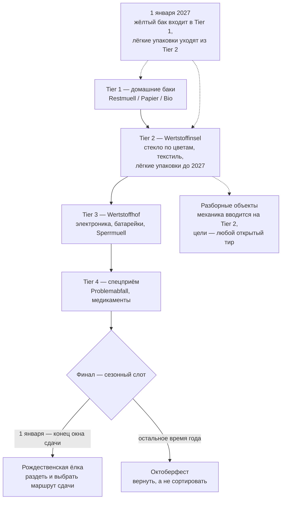

# Munich Waste Sorting Game - Plan

## Goal Capsule

- **Цель.** Мобильная веб-игра, которая учит сортировке мусора в Мюнхене через растущую ленту контейнеров, и одновременно служит публичным портфолио-артефактом: постановка задачи, архитектурное решение, UX/UI, вывод в продакшен и сопровождение через смену предметной области 1 января 2027.
- **Продуктовая ответственность.** Документ описывает первый релиз (осень 2026) и январский релиз 2027 как один связный продукт. Акт публикации входит в объём первого релиза; партнёрство с AWM и версии для других городов — нет.
- **Открытые блокеры.** Нет. Неопубликованный перечень предметов, меняющих адрес при вводе Gelbe Tonne, ведётся как внешняя зависимость по данным.

---

## Product Contract

### Summary

Мобильная веб-игра, где мусор падает сверху, а снизу лента контейнеров, которую игрок свайпом подводит под предмет. Контейнеры добавляются по мере прохождения, повторяя реальную структуру мюнхенской системы. Финал меняется по календарю: Октоберфест большую часть года, рождественская ёлка в её сезон. 1 января 2027 лента получает жёлтый бак и теряет контейнер лёгких упаковок — изменением данных, не кода.

### Problem Frame

Мюнхен устроен не так, как остальная Германия, и часть этих отличий переживёт 2027 год, а часть нет. Долгоиграющие: стекло и текстиль сдают на Wertstoffinseln, а не забирают от дома; из трёх домашних баков платный только Restmüll; крупногабарит, электроника и опасные отходы идут через Wertstoffhöfe; Gelber Sack в городе не появляется никогда. Приезжий приходит сюда с моделью из прошлого города, и она не совпадает.

Трудность при этом не там, где её ожидают. Четыре бака запоминаются за вечер. Ломается человек на границах внутри категории, которую считает освоенной: ламинированный конвертик от чайного пакетика, коробка от пиццы, спрессованный лоток от яиц. Пиццакартон по правилам AWM разбирается: чистый картон в Papier, остатки еды в Bio. Верный ответ — не «в какой бак», а «разбери объект».

Второй слой — заблуждение о санкциях. За бытовую ошибку сортировки в Баварии грозит порядка 20 евро, и на практике санкция обычно другая: бак с примесями вывозят как Restmüll и выставляют счёт. Крупные штрафы относятся к незаконному выбросу — но и там верных маршрутов обычно несколько, и игра, называющая верным один, ошибается не в пользу игрока.

Третий слой — что верный ответ не всегда «в какой-то контейнер». На Октоберфесте с 1991 года запрещена одноразовая посуда: многоразовую посуду и залоговую тару возвращают, и объём мусора после запрета упал примерно в девять раз. Человек, привыкший всё сортировать, здесь ошибается тем, что сортирует.

Четвёртый слой — время. С 1 января 2027 город вводит Gelbe Tonne, баки развозят с ноября 2026, а контейнеры для лёгких упаковок с Wertstoffinseln уезжают. Переучиваться будет весь город, а не только приезжие, и часть сказанного выше в этот день перестанет быть верной.

### Key Decisions

- KD1. **Падающий мусор и свайп-лента контейнеров** (session-settled: user-directed — chosen over ежедневный формат в духе Wordle: лестница контейнеров учит устройству системы, плоский список предметов не учит). Governs R1, R3.
- KD2. **Узко, но до конца: все тиры и финал в первом релизе** (session-settled: user-approved — chosen over широкое покрытие Abfalllexikon: финал — то, чем делятся, покрытие — нет). Governs R3, R5.
- KD3. **Скорость падения зависит от предмета.** Аркадное давление мешает думать ровно там, где думать надо. Governs R2.
- KD4. **Правила и состав тиров живут данными, отдельно от игровой логики.** Единственный способ пережить 1 января 2027 без переписывания — и переход убирает контейнер, а не только меняет адреса. Governs R10, R11, R13, R16.
- KD5. **Универсальность архитектуры не выходит наружу** (session-settled: user-approved — chosen over явный мультигород в интерфейсе: обобщённое не пересылают знакомым). Governs R11.
- KD6. **DE и EN в первом релизе, UK и TR языковым тактом позже** (session-settled: user-directed — chosen over все четыре сразу: вычитка на TR и UK требует носителей, это внешняя зависимость на критическом пути). Governs R16.
- KD7. **Игра не преувеличивает санкции и не сужает верные маршруты.** Ложная угроза штрафом на верном ответе разрушает доверие сильнее любой другой ошибки. Governs R7, R12.
- KD8. **Финал — сезонный слот, а не фиксированный уровень** (session-settled: user-directed — chosen over единственный финал с ёлкой: осенний запуск получает завершённую игру, а январь — новый контент вдобавок к жёлтому баку). Governs R5, R6, R7.
- KD9. **Правовой минимум входит в объём релиза, а не следует за ним.** Режим сбора статистики без согласия и обязательные страницы дешевле заложить, чем встраивать после запуска. Governs R19, R20.
- KD10. **Доступность не полагается на цвет нигде.** Стекло по цветам — единственное место в системе, где цвет несёт адрес, и именно эта пара хуже всего различима при дальтонизме. Governs R9.

### Requirements

**Ядро геймплея**

- R1. Предметы падают сверху; внизу горизонтальная лента контейнеров; игрок свайпом перемещает ленту так, чтобы предмет попал в нужный контейнер.
- R2. Скорость падения задаётся на уровне предмета: знакомые падают быстро и держат ритм, пограничные падают заметно медленнее и выделяются.
- R3. Лента растёт по четырём тирам, повторяющим структуру города: домашние баки → Wertstoffinsel → Wertstoffhof → спецприём. Новый тир вводится, когда предыдущий пройден.
- R4. Часть предметов нельзя отправить целиком: игрок сначала разделяет их жестом, затем сортирует получившиеся части по разным контейнерам.
- R5. Финал не решается лентой контейнеров и определяется календарём: с 1 января до конца окна сдачи ёлок — финал «Ёлка», в остальное время года — финал «Октоберфест». Смена выполняется как смена данных сезона.
- R6. В финале «Октоберфест» часть предметов не является мусором: многоразовую посуду и залоговую тару возвращают, и игрок должен отказаться их сортировать.
- R7. В финале «Ёлка» игрок раздевает дерево и выбирает маршрут сдачи. Маршрут — отдельное измерение данных сезона: у каждого свои границы доступности либо признак круглогодичности, своё правило подготовки дерева и свои ограничения. Верными засчитываются все действующие маршруты; illegale Müllablagerung показывается только для места вне любого из них.
- R8. После неверного ответа игра показывает верный адрес и одну строку объяснения, прежде чем продолжить.
- R9. Цвет никогда не единственный носитель смысла. Независимый от цвета сигнал обязателен для контейнеров, для выделения пограничных предметов и для самих падающих предметов, чей верный адрес определяется цветом — в первую очередь для стекла.

**Контент и достоверность**

- R10. Каждый предмет, каждый маршрут сдачи и каждый параметр сезонного финала привязан к записи AWM — Abfalllexikon либо профильной странице — с датой сверки; без такой привязки контент в игру не попадает.
- R11. Правила сортировки и состав контейнеров каждого тира хранятся отдельно от игровой логики, город присутствует в данных как параметр и не отображается в интерфейсе как выбор.
- R12. Игра сообщает о денежных последствиях только там, где они реальны, и разделяет бытовую ошибку сортировки и незаконный выброс.

**Переход на Gelbe Tonne**

- R13. 1 января 2027 в первом тире появляется жёлтый бак, а из второго тира исчезает контейнер лёгких упаковок — там остаются стекло и текстиль; предметы, сменившие адрес, оцениваются по новому правилу. Всё выполняется изменением данных, без правки игровой логики.
- R14. Любой игрок в первой сессии после 1 января 2027 получает сообщение о том, что правила изменились, какие предметы сменили адрес и что делать до появления жёлтого бака во дворе. Опознание вернувшегося игрока — необязательное улучшение: отметка о показанном сообщении хранится только на устройстве, не передаётся обработчику статистики, не связывается с событиями, живёт до конца переходного периода и затем удаляется.
- R15. Вводный текст игры обновляется вместе с правилами: описание системы города не должно пережить смену, которую оно описывает.

**Локализация**

- R16. Тексты интерфейса и контент правил разделены; добавление языка не требует изменения кода. Первый релиз — DE и EN.

**Охват, правовой минимум и наблюдаемость**

- R17. Пройденная игра даёт результат, пригодный к пересылке одним действием, без регистрации; результат не содержит идентификатора отправителя, сессии или устройства.
- R18. Первый релиз считается выпущенным только после акта публикации по списку мюнхенских точек входа. Каждая точка публикуется отдельной ссылкой с меткой источника; для каналов с модерацией публикация засчитывается по факту отправки, а не одобрения.
- R19. Собирается статистика: доходимость до каждого тира, доля ошибок по каждому предмету, источник перехода. Клиентский код не сохраняет в устройстве игрока никакой информации и не читает уже сохранённую — ни cookie, ни localStorage, sessionStorage или IndexedDB, ни отпечаток из характеристик устройства и браузера; собирается только то, что браузер передаёт в самом запросе, IP усекается на приёме. Обработчик размещён в ЕС по договору обработки. Источник перехода определяется меткой из R18, домен реферера — запасной сигнал; метка не содержит идентификатора игрока, сессии или устройства. Сырые события хранятся не дольше 90 дней, агрегированные показатели — бессрочно. Атрибуция переходов считается агрегатно и не связывает факт пересылки с фактом открытия.
- R20. Продукт публикует Datenschutzerklärung и Impressum, доступные с любого экрана. Содержание уведомления не уже объёма Art. 13 DSGVO — ответственное лицо и контакт, цели и правовое основание, категории получателей, срок хранения, права субъекта и право на жалобу в надзорный орган; поверх этого минимума называются конкретный перечень собираемых событий и срок хранения из R19.

### Progression ladder

### Key Flows

- F1. Обычный уровень
  - **Триггер:** игрок открывает тир.
  - **Шаги:** предметы падают по одному; игрок свайпает ленту; попадание засчитывается, промах вызывает объяснение и продолжение.
  - **Итог:** тир пройден, следующий контейнер добавлен в ленту.
  - **Covers R1, R2, R3, R8, R9.**

- F2. Разборный объект
  - **Триггер:** падает предмет, помеченный как составной.
  - **Шаги:** падение замедляется; игрок разделяет предмет жестом; каждая часть сортируется отдельно.
  - **Итог:** полная разборка засчитывается выше, чем отправка целиком.
  - **Covers R2, R4.**

- F3. Финал «Октоберфест»
  - **Триггер:** пройден четвёртый тир, текущая дата вне окна сдачи ёлок.
  - **Шаги:** прилетают предметы с Wiesn; игрок отправляет мусор в контейнеры, а многоразовую посуду и залоговую тару — обратно, отдельным действием.
  - **Итог:** игра пройдена; результат готов к пересылке.
  - **Covers R5, R6, R17.**

- F4. Финал «Ёлка»
  - **Триггер:** пройден четвёртый тир, текущая дата внутри окна сдачи ёлок.
  - **Шаги:** игрок снимает с дерева украшения, подставку и пластик; выбирает маршрут сдачи; выполняет условия выбранного маршрута — подготовку дерева и, если маршрут ограничен по времени, дату внутри его окна.
  - **Итог:** игра пройдена; результат готов к пересылке.
  - **Covers R5, R7, R12, R17.**

- F5. Переключение правил
  - **Триггер:** наступает 1 января 2027.
  - **Шаги:** данные правил переключаются на новую редакцию; жёлтый бак входит в первый тир, лёгкие упаковки уходят из второго; финальный слот переходит на ёлку; вводный текст обновляется; игрок в первой сессии видит сообщение об изменении.
  - **Итог:** игра работает по новым правилам, с новым составом тиров и новым финалом без правки игровой логики.
  - **Covers R5, R11, R13, R14, R15.**

### Acceptance Examples

- AE1. **Covers R4, R10.** Дано: падает коробка от пиццы с остатками. Когда игрок отправляет её целиком в Papier — засчитывается ошибка, и объяснение говорит, что чистый картон идёт в Papier, а остатки еды в Bio. Когда игрок сначала разделяет коробку и отправляет части по разным контейнерам — засчитывается полный результат.
- AE2. **Covers R2, R8.** Дано: падает конвертик от чайного пакетика с ламинированной стороной. Тогда предмет падает в замедленном режиме и выделен, а при ошибке объяснение называет причину — композитный материал.
- AE3. **Covers R6.** Дано: в финале «Октоберфест» прилетает Maßkrug. Когда игрок отправляет его в любой контейнер — засчитывается ошибка, потому что многоразовая посуда возвращается, а не выбрасывается.
- AE4. **Covers R7, R12.** Дано: игрок в финале «Ёлка» выбирает маршрут сдачи. Когда он везёт измельчённое дерево на Wertstoffhof — засчитывается верно независимо от даты. Когда он относит целое дерево на обозначенную Sammelstelle внутри её окна — засчитывается верно. Когда он оставляет дерево в месте, не относящемся ни к одному действующему маршруту, — игра показывает, что это квалифицируется как illegale Müllablagerung, и это одно из немногих мест, где называется размер реального штрафа.
- AE5. **Covers R13, R14.** Дано: игрок открывает игру в первой сессии после 1 января 2027. Тогда он видит сообщение об изменении правил и оговорку о том, что делать до появления бака во дворе; в ленте появляется жёлтый бак, из второго тира исчезают лёгкие упаковки, предметы со сменившимся адресом оцениваются по новой редакции, а финалом становится ёлка.
- AE6. **Covers R9.** Дано: игрок не различает цвета. Тогда и контейнеры для стекла, и сами падающие бутылки распознаются по независимому от цвета признаку — зелёная и коричневая различимы без опоры на цвет, — и прохождение второго тира остаётся возможным.

### Success Criteria

- Публичный запуск состоялся внутри окна Октоберфеста 2026: целевая дата — 19 сентября, крайняя граница окна внимания — 4 октября.
- Игра продолжает работать после 1 января 2027 без правки игровой логики при переключении правил, смене состава тиров и смене финала.
- Переключение зафиксировано публично: до и после видно на скриншотах ленты контейнеров и финального уровня.
- Есть измеримый охват: переходы из внешних источников с различением точек входа, доля прошедших до финала, доля переславших результат.
- Каждый предмет, каждый маршрут сдачи и каждый параметр сезонного финала прослеживается до записи AWM с датой сверки.

### Scope Boundaries

**Отложено на потом**

- Ежедневный формат «предмет дня» как канал раздачи.
- Украинский и турецкий языки.
- Расширение покрытия за пределы четырёх тиров и финалов.
- Отдельный тренировочный режим для отработки разборных объектов вне прохождения (сама разборка внутри уровней входит в первый релиз, см. R4).
- Дополнительные сезонные финалы за пределами Октоберфеста и ёлки.

**Вне идентичности продукта**

- Аккаунты, лидерборды, монетизация.
- Явный выбор города в интерфейсе: параметризация живёт в данных, продукт снаружи — про Мюнхен.
- Измерение индивидуального образовательного результата игрока: продукт оптимизируется на охват. Агрегированная по предметам статистика ошибок из R19 к этому не относится — она измеряет контент, а не игрока.

### Dependencies / Assumptions

- AWM остаётся публично доступным источником истины по предметам, маршрутам сдачи и параметрам сезонных финалов. Страница по ёлкам публикуется только в сезон, поэтому сверка ёлочных данных выполняется в декабре 2026 по свежей публикации, а не переносом прошлогодних.
- Маршрутов сдачи ёлки несколько, и у каждого свои условия. Редакция 2026: Wertstoffhöfe принимают до 20 измельчённых деревьев бесплатно круглый год и названы первым адресом; открытые Sammelstellen принимают целое раздетое дерево с 7 января по 4 февраля; вывозка от Hausverwaltung платная и идёт с 19 января по 27 февраля по заявке. Дерево в любом случае полностью раздето.
- Ввод Gelbe Tonne с 1 января 2027 состоится в объявленные сроки. Развоз баков идёт волнами с ноября 2026, окраины раньше плотной центральной застройки, и жёлтый бак не является обязательным к установке — часть игроков в январе получит правило раньше, чем бак.
- Финальный перечень предметов, меняющих адрес при вводе Gelbe Tonne, AWM опубликует до декабря 2026. Механизм R13 от перечня не зависит; ожидаются только данные.
- Запрет одноразовой посуды на Октоберфесте, действующий с 1991 года, сохраняется.
- Носители украинского и турецкого для вычитки появляются к декабрю 2026; иначе языковой такт UK/TR сдвигается. На январский релиз это не влияет — это независимая линия.
- Impressum по §5 DDG требует ladungsfähige Anschrift; абонентский ящик не подходит. Адрес для публикации выбирается и оформляется заранее, чтобы не блокировать акт публикации из R18. То же относится к контакту ответственного лица в уведомлении.
- Объём первого релиза складывается из четырёх потоков: сборка механик, включая вторую финальную, — порядка пяти выходных; подготовка контента — сверка каждого предмета и маршрута с AWM плюс тексты объяснений на DE и EN — оценивается отдельно и масштабируется от числа предметов на тир, которое пока не задано; правовой минимум R19 и R20; подготовка и размещение публикаций по R18 с лагом на модерацию.
- Октоберфест 2026 идёт с 19 сентября по 4 октября. От даты этого документа до открытия остаётся пять выходных, то есть одна только сборка механик занимает доступный календарь целиком.

### Outstanding Questions

**Resolve Before Planning**

- Дата запуска против арифметики оценки. Критерий успеха целится в 19 сентября, но от 10 августа до этой даты пять выходных, а оценка сборки механик — «порядка пяти выходных», не считая контента, правового минимума и публикации. Ревьюеры второго раунда считают целевую дату недостижимой и предлагают сделать порогом 4 октября. Целевая дата выбрана осознанно в первом раунде, поэтому решение остаётся за автором: подтвердить 19 сентября и резать объём, сдвинуть порог на 4 октября, или пересчитать оценку после того, как определится число предметов на тир.
- Перечень мюнхенских точек входа для R18. Требование делает акт публикации условием выпуска, но список каналов нигде не назван, а от него зависят и лаг на модерацию, и метки источника в R19.

**Deferred to Planning**

- Сколько предметов на тир считается достаточным для пройденного тира — от этой цифры считается контентная часть оценки объёма.
- Переиспользуют ли действия финала «Ёлка» — снятие украшений, выбор маршрута, выполнение его условий — интерфейс падения и ленты, или это новые экранные паттерны.
- Что происходит с лентой при росте числа контейнеров на маленьком экране: прокрутка, уменьшение, группировка.
- Что режется первым, если объём не укладывается в окно: приоритетный порядок внутри требований.
- Чем обеспечивается портфолио-половина цели: публичный репозиторий, разбор постановки и архитектуры, сравнение «до и после» переключения — и в каком объёме это входит в первый релиз.
- Нужен ли туториал или облегчённый старт первого тира для игрока, пришедшего по чужой ссылке.
- Какой жест разбирает составной предмет и как он отличается от свайпа ленты.
- Как контейнеры визуально идентифицируются — иконка, подпись или комбинация — с учётом расширения текста при переводе.
- Технический стек и способ хранения данных правил.
- Форма пересылаемого результата, и не создаёт ли она серверной записи о конкретной пересылке.
- Какой обработчик статистики в ЕС выбирается и подтверждено ли, что его клиентский код не читает характеристики браузера сверх передаваемых в запросе.
- Кто выступает ответственным лицом по DSGVO — физическое лицо автора или юридическое лицо.
- Определяется ли момент переключения сезона и редакции правил часами устройства или доверенным источником времени.
- Как процесс сверки забирает данные из AWM — ручной выгрузкой или автоматическим обходом.

### Sources / Research

- AWM Abfalllexikon — источник по каждому предмету: `https://www.awm-muenchen.de/abfall-entsorgen/abfalllexikon`
- Устройство мюнхенской системы, три бака и Wertstoffinseln: `https://www.awm-muenchen.de/entsorgen/das-muenchner-muellsystem`
- Проект Gelbe Tonne, сроки и параметры: `https://www.awm-muenchen.de/unternehmen/projekte/gelbe-tonne`
- FAQ по Gelbe Tonne, включая замену контейнеров на Wertstoffinseln и необязательность бака: `https://www.awm-muenchen.de/unternehmen/projekte/gelbe-tonne/faq-gelbe-tonne`
- Решение о вводе с 2027 года: `https://ru.muenchen.de/2026/85/Einfuehrung-der-Gelben-Tonne-nimmt-naechste-Huerde-124132`
- Маршруты сдачи рождественских ёлок, места и окна: `https://www.awm-muenchen.de/abfall-entsorgen/abgabestellen/christbaumentsorgung`
- Мусорная концепция AWM на Октоберфесте, запрет одноразовой посуды с 1991 года: `https://www.awm-muenchen.de/abfall-entsorgen/services/veranstaltungsmuell`
- Экологическая концепция Октоберфеста, объёмы и эффект запрета: `https://stadt.muenchen.de/dam/jcr:3147c2a4-5230-40c7-8ef6-294a73927405/23_Oktoberfest_oekologisch.pdf`
- Размеры штрафов в сфере обращения с отходами: `https://www.bussgeld-info.de/muell-muellentsorgung/`
- Конкурентное поле обучающих игр про сортировку: #wirfuerbio Sortierspiel, Die Müll AG (Карлсруэ), браузерные сортировки на plays.org — все ориентированы на детей и обобщённую Германию, городской специфики нет.
