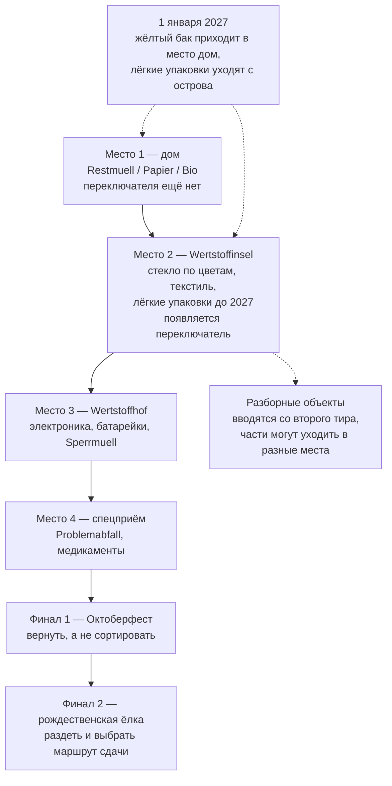

# Munich Waste Sorting Game - Plan

## Goal Capsule

- **Цель.** Мобильная веб-игра, которая учит сортировке мусора в Мюнхене через растущую структуру мест и контейнеров, и одновременно служит публичным портфолио-артефактом: постановка задачи, архитектурное решение, UX/UI, вывод в продакшен и сопровождение через смену предметной области 1 января 2027.
- **Продуктовая ответственность.** Документ описывает первый релиз (осень 2026) и январский релиз 2027 как один связный продукт. Акт публикации входит в объём первого релиза; партнёрство с AWM и версии для других городов — нет.
- **Открытые блокеры.** Два, оба в разделе Resolve Before Planning: целевая дата запуска против арифметики оценки и перечень мюнхенских точек входа для R20.

---

## Product Contract

### Summary

Мобильная веб-игра, где мусор падает сверху, а снизу лента контейнеров одного места — дома, острова, Wertstoffhof или спецприёма. Игрок сначала выбирает место, потом свайпом подводит нужный контейнер. Места добавляются по мере прохождения, повторяя реальную структуру города, а завершают игру два финала подряд — Октоберфест и рождественская ёлка, доступные круглый год. 1 января 2027 жёлтый бак появляется дома, а лёгкие упаковки уходят с острова — изменением данных, не кода.

### Problem Frame

Мюнхен устроен не так, как остальная Германия, и часть этих отличий переживёт 2027 год, а часть нет. Долгоиграющие: стекло и текстиль сдают на Wertstoffinseln, а не забирают от дома; из трёх домашних баков платный только Restmüll; крупногабарит, электроника и опасные отходы идут через Wertstoffhöfe; Gelber Sack в городе не появляется никогда. Приезжий приходит сюда с моделью из прошлого города, и она не совпадает.

Трудность при этом не там, где её ожидают. Четыре бака запоминаются за вечер. Не запоминается за вечер другое — что у мусора есть не только бак, но и место: часть выносится во двор, часть относится на остров, часть везётся на Wertstoffhof, часть сдаётся отдельно. Приезжий, у которого дома был жёлтый мешок, по умолчанию считает, что всё забирают от дома, и ошибается на уровне места, а не контейнера.

Второй слой трудности — границы внутри категории, которую человек считает освоенной: ламинированный конвертик от чайного пакетика, коробка от пиццы, спрессованный лоток от яиц. Пиццакартон по правилам AWM разбирается: чистый картон в Papier, остатки еды в Bio. У йогуртового стаканчика части расходятся не по бакам, а по местам.

Третий слой — что верный ответ не всегда «в какой-то контейнер». На Октоберфесте с 1991 года запрещена одноразовая посуда: многоразовую посуду и залоговую тару возвращают, и объём мусора после запрета упал примерно в девять раз. Человек, привыкший всё сортировать, здесь ошибается тем, что сортирует. У ёлки верный ответ — маршрут, и маршрутов несколько.

Четвёртый слой — заблуждение о санкциях. За бытовую ошибку сортировки в Баварии грозит порядка 20 евро, и на практике санкция обычно другая: бак с примесями вывозят как Restmüll и выставляют счёт. Крупные штрафы относятся к незаконному выбросу — но и там верных маршрутов обычно несколько, и игра, называющая верным один, ошибается не в пользу игрока.

Пятый слой — время. С 1 января 2027 город вводит Gelbe Tonne, баки развозят с ноября 2026, а контейнеры для лёгких упаковок с Wertstoffinseln уезжают. Переучиваться будет весь город, и меняется при этом именно место, а не только адрес отдельных предметов.

### Key Decisions

- KD1. **Падающий мусор и свайп-лента контейнеров** (session-settled: user-directed — chosen over ежедневный формат в духе Wordle: лестница мест учит устройству системы, плоский список предметов не учит). Governs R1, R4.
- KD2. **Узко, но до конца: все места и оба финала в первом релизе** (session-settled: user-approved — chosen over широкое покрытие Abfalllexikon: финал — то, чем делятся, покрытие — нет). Governs R4, R6.
- KD3. **Контейнеры сгруппированы по местам, лента показывает одно место за раз** (session-settled: user-directed — chosen over плоская лента со всеми контейнерами: к четвёртому тиру их было бы четырнадцать, но главное — группировка делает явным вопрос «где это выбрасывают», который и есть настоящая трудность приезжего). Governs R1, R2, R4.
- KD4. **Скорость падения зависит от предмета.** Аркадное давление мешает думать ровно там, где думать надо, а смена места требует лишнего действия под таймером. Governs R3.
- KD5. **Правила, состав мест и состав контейнеров живут данными, отдельно от игровой логики.** Единственный способ пережить 1 января 2027 без переписывания — и переход переносит контейнер между местами, а не только меняет адреса. Governs R13, R15, R18.
- KD6. **Универсальность архитектуры не выходит наружу** (session-settled: user-approved — chosen over явный мультигород в интерфейсе: обобщённое не пересылают знакомым). Governs R13.
- KD7. **DE и EN в первом релизе, UK и TR языковым тактом позже** (session-settled: user-directed — chosen over все четыре сразу: вычитка на TR и UK требует носителей, это внешняя зависимость на критическом пути). Governs R18.
- KD8. **Игра не преувеличивает санкции и не сужает верные маршруты.** Ложная угроза штрафом на верном ответе разрушает доверие сильнее любой другой ошибки. Governs R8, R14.
- KD9. **Два финала подряд, доступные круглый год: сначала Октоберфест, затем ёлка** (session-settled: user-directed — chosen over сезонное переключение финалов: «как выбрасывать ёлку» — вопрос круглогодичный, маршрут через Wertstoffhof работает весь год, а игра получает настоящую концовку без сезонной машинерии). Governs R6, R7, R8.
- KD10. **Обязательный правовой минимум входит в релиз безусловно.** Публикация без Impressum и Datenschutzerklärung незаконна независимо от того, собирается ли статистика. Governs R22.
- KD11. **Доступность не полагается на цвет нигде.** Стекло по цветам — единственное место в системе, где цвет несёт адрес, и именно эта пара хуже всего различима при дальтонизме. Governs R10.
- KD12. **Сбор статистики элективен и первым переносится при нехватке времени.** Это единственное релизное обязательство с внешним контрагентом, и без него продукт остаётся законным. Governs R21.
- KD13. **Устаревшие сезонные данные показываются с датой, а не скрываются.** Сезонные страницы AWM публикуются не круглый год, и молчание хуже честной пометки. Governs R12.

### Requirements

**Ядро геймплея**

- R1. Предметы падают сверху; внизу горизонтальная лента контейнеров одного места; игрок свайпом перемещает ленту так, чтобы предмет попал в нужный контейнер.
- R2. Контейнеры сгруппированы по местам: дом, Wertstoffinsel, Wertstoffhof, спецприём. Лента показывает контейнеры одного места за раз; смена места — отдельное действие, независимое от свайпа ленты. Ни на одном месте лента не длиннее пяти контейнеров.
- R3. Предмет может нести признак «пограничный»: такой падает заметно медленнее остальных и визуально выделен. Предмет, верное место которого отличается от активного, падает медленнее в любом случае — смена места требует дополнительного действия под таймером.
- R4. Игра растёт по четырём тирам, каждый из которых вводит новое место в порядке реальной структуры города: дом → Wertstoffinsel → Wertstoffhof → спецприём. Первый тир содержит только дом и не показывает переключатель мест; переключатель появляется вместе со вторым местом. Новый тир вводится, когда предыдущий пройден, и ранее открытые места остаются доступны.
- R5. Предмет может нести признак «разборный», независимый от признака «пограничный»: такой нельзя отправить целиком, игрок сначала разделяет его жестом, затем сортирует части. Части могут уходить в контейнеры разных мест. Механика разборки вводится начиная со второго тира.
- R6. После четвёртого тира игрок проходит два финала подряд: сначала «Октоберфест», затем «Ёлка» как последний уровень игры. Оба доступны круглый год и не зависят от календаря. Финал не сводится к выбору контейнера: верным действием может быть возврат предмета или выбор маршрута сдачи.
- R7. В финале «Октоберфест» часть предметов не является мусором: многоразовую посуду и залоговую тару возвращают, и игрок должен отказаться их сортировать.
- R8. В финале «Ёлка» игрок раздевает дерево и выбирает маршрут сдачи. Маршрут — отдельное измерение данных: у каждого свои границы доступности либо признак круглогодичности, своё правило подготовки дерева и свои ограничения. Верными засчитываются все действующие маршруты; illegale Müllablagerung показывается только для места вне любого из них.
- R9. После неверного ответа игра показывает верный адрес и одну строку объяснения, прежде чем продолжить. Когда ошибка в выборе места, а не контейнера, объяснение адресует именно место.
- R10. Цвет никогда не единственный носитель смысла. Независимый от цвета сигнал обязателен для контейнеров, для выделения пограничных предметов и для самих падающих предметов, чей верный адрес определяется цветом — в первую очередь для стекла.

**Контент и достоверность**

- R11. Каждый предмет, каждый маршрут сдачи и каждый параметр финала привязан к записи AWM — Abfalllexikon либо профильной странице — с датой сверки.
- R12. Когда актуальная редакция сезонных данных ещё не опубликована, игра использует последнюю сверенную редакцию, показывает её год и дату сверки и отправляет игрока за текущим перечнем на сайт AWM. Скрывать контент из-за отсутствия свежей редакции нельзя; выдавать устаревшую за текущую — тоже.
- R13. Правила сортировки, состав мест и состав контейнеров каждого места хранятся отдельно от игровой логики, город присутствует в данных как параметр и не отображается в интерфейсе как выбор.
- R14. Игра сообщает о денежных последствиях только там, где они реальны, и разделяет бытовую ошибку сортировки и незаконный выброс.

**Переход на Gelbe Tonne**

- R15. 1 января 2027 жёлтый бак появляется среди контейнеров места «дом», а контейнер лёгких упаковок исчезает из места «Wertstoffinsel» — там остаются стекло и текстиль; предметы, сменившие адрес, оцениваются по новому правилу. Всё выполняется изменением данных, без правки игровой логики.
- R16. На протяжении переходного периода игра в начале каждой сессии показывает сообщение о том, что правила изменились, какие предметы сменили место, и что делать до появления жёлтого бака во дворе. Сообщение читается без знания прежних правил: сначала называется действующее правило, затем — что и на что сменилось. Никакой отметки о показе на устройстве не сохраняется.
- R17. Вводный текст игры обновляется вместе с правилами: описание системы города не должно пережить смену, которую оно описывает.

**Локализация**

- R18. Тексты интерфейса и контент правил разделены; добавление языка не требует изменения кода. Первый релиз — DE и EN.

**Охват, правовой минимум и наблюдаемость**

- R19. Пройденная игра даёт результат, пригодный к пересылке одним действием, без регистрации; результат не содержит идентификатора отправителя, сессии или устройства.
- R20. Первый релиз считается выпущенным только после акта публикации по списку мюнхенских точек входа. Каждая точка публикуется отдельной ссылкой с меткой источника; для каналов с модерацией публикация засчитывается по факту отправки, а не одобрения.
- R21. Собираются события: доходимость до каждого тира, ошибки по каждому предмету с различением ошибки места и ошибки контейнера, источник перехода, завершение каждого финала и факт вызова пересылки результата. Клиентский код не сохраняет в устройстве игрока никакой информации и не читает уже сохранённую — ни cookie, ни localStorage, sessionStorage или IndexedDB, ни отпечаток из характеристик устройства и браузера; собирается только то, что браузер передаёт в самом запросе, IP усекается на приёме. Обработчик размещён в ЕС по договору обработки. Источник перехода определяется меткой из R20, домен реферера — запасной сигнал; ни метка, ни событие пересылки не содержат идентификатора игрока, сессии или устройства, и факт пересылки не связывается с фактом открытия. Сырые события хранятся не дольше 90 дней, агрегированные показатели — бессрочно.
- R22. Продукт публикует Datenschutzerklärung и Impressum, доступные с любого экрана. Содержание уведомления не уже объёма Art. 13 DSGVO — ответственное лицо и контакт, цели и правовое основание, категории получателей, срок хранения, права субъекта и право на жалобу в надзорный орган; поверх этого минимума называются конкретный перечень собираемых событий и срок хранения из R21.

### Progression ladder

### Key Flows

- F1. Обычный уровень
  - **Триггер:** игрок открывает тир.
  - **Шаги:** предметы падают по одному; игрок при необходимости переключает место, затем свайпает ленту; попадание засчитывается, промах вызывает объяснение и продолжение.
  - **Итог:** тир пройден, новое место добавлено и доступно наравне с прежними.
  - **Covers R1, R2, R3, R4, R9, R10.**

- F2. Разборный объект
  - **Триггер:** падает предмет с признаком «разборный».
  - **Шаги:** игрок разделяет предмет жестом; каждая часть сортируется отдельно, при необходимости со сменой места.
  - **Итог:** полная разборка засчитывается выше, чем отправка целиком.
  - **Covers R2, R5.**

- F3. Финал «Октоберфест»
  - **Триггер:** пройден четвёртый тир.
  - **Шаги:** прилетают предметы с Wiesn; игрок отправляет мусор в контейнеры, а многоразовую посуду и залоговую тару — обратно, отдельным действием.
  - **Итог:** первый финал пройден, открывается второй.
  - **Covers R6, R7.**

- F4. Финал «Ёлка»
  - **Триггер:** пройден финал «Октоберфест».
  - **Шаги:** игрок снимает с дерева украшения, подставку и пластик; выбирает маршрут сдачи; выполняет условия выбранного маршрута — подготовку дерева и, если маршрут ограничен по времени, дату внутри его окна. Если актуальный перечень мест не опубликован, игра показывает последний сверенный с его годом и ссылкой на сайт AWM.
  - **Итог:** игра пройдена; результат готов к пересылке.
  - **Covers R6, R8, R12, R14, R19.**

- F5. Миграция 1 января 2027
  - **Триггер:** наступает 1 января 2027.
  - **Шаги:** данные правил переключаются на новую редакцию; жёлтый бак приходит в место «дом», лёгкие упаковки уходят с места «Wertstoffinsel»; вводный текст обновляется; на протяжении переходного периода в начале каждой сессии показывается сообщение об изменении.
  - **Итог:** игра работает по новым правилам и с новым составом мест без правки игровой логики.
  - **Covers R13, R15, R16, R17.**

### Acceptance Examples

- AE1. **Covers R2, R3, R9.** Дано: во втором тире активно место «дом», падает стеклянная бутылка. Тогда бутылка падает медленнее, потому что её место отличается от активного; когда игрок отправляет её в домашний контейнер — засчитывается ошибка, и объяснение говорит про место, а не про бак: стекло относят на Wertstoffinsel.
- AE2. **Covers R5, R11.** Дано: падает коробка от пиццы с остатками. Когда игрок отправляет её целиком в Papier — засчитывается ошибка, и объяснение говорит, что чистый картон идёт в Papier, а остатки еды в Bio. Когда игрок сначала разделяет коробку и отправляет части по разным контейнерам — засчитывается полный результат.
- AE3. **Covers R2, R5.** Дано: падает йогуртовый стаканчик с фольгой и бумажной манжетой. Тогда полная разборка требует смены места: манжета идёт в домашний Papier, а стаканчик и фольга — в контейнер лёгких упаковок на Wertstoffinsel.
- AE4. **Covers R3, R5, R9.** Дано: падает конвертик от чайного пакетика с ламинированной стороной. Предмет несёт признак «пограничный», но не «разборный»: он падает медленнее и выделен, жест разделения на нём недоступен, а при ошибке объяснение называет причину — композитный материал.
- AE5. **Covers R7.** Дано: в финале «Октоберфест» прилетает Maßkrug. Когда игрок отправляет его в любой контейнер — засчитывается ошибка, потому что многоразовая посуда возвращается, а не выбрасывается.
- AE6. **Covers R8, R14.** Дано: игрок в финале «Ёлка» выбирает маршрут сдачи. Когда он везёт измельчённое дерево на Wertstoffhof — засчитывается верно независимо от даты. Когда он относит целое дерево на обозначенную Sammelstelle внутри её окна — засчитывается верно. Когда он оставляет дерево в месте, не относящемся ни к одному действующему маршруту, — игра показывает, что это квалифицируется как illegale Müllablagerung, и это одно из немногих мест, где называется размер реального штрафа.
- AE7. **Covers R12.** Дано: игрок открывает финал «Ёлка» в июле, когда сезонная страница AWM не опубликована. Тогда игра показывает перечень мест прошлого сезона, явно называет его год и дату сверки и даёт ссылку на страницу AWM за текущим перечнем.
- AE8. **Covers R15, R16.** Дано: игрок открывает игру внутри переходного периода после 1 января 2027. Тогда он в начале сессии видит сообщение, которое сначала называет действующее правило, затем — что и на что сменилось, и что делать до появления бака во дворе; в месте «дом» есть жёлтый бак, из места «Wertstoffinsel» исчезли лёгкие упаковки, предметы со сменившимся местом оцениваются по новой редакции. Повторный вход в новой сессии показывает сообщение снова.
- AE9. **Covers R10.** Дано: игрок не различает цвета. Тогда и контейнеры для стекла, и сами падающие бутылки распознаются по независимому от цвета признаку — зелёная и коричневая различимы без опоры на цвет, — и прохождение второго тира остаётся возможным.
- AE10. **Covers R18.** Дано: в игру добавляется третий язык. Тогда изменения затрагивают только файлы текстов и данных правил; сборка игровой логики не меняется.
- AE11. **Covers R20.** Дано: игра опубликована по списку точек входа. Тогда каждая опубликованная ссылка несёт собственную метку источника, а для канала с модерацией акт публикации засчитан в момент отправки материала.
- AE12. **Covers R21, R22.** Дано: игрок прошёл игру целиком и переслал результат. Тогда в устройстве нет ни одной записи — ни cookie, ни localStorage, sessionStorage или IndexedDB; событие пересылки записано как агрегатный счётчик без идентификатора; Datenschutzerklärung и Impressum открываются с любого экрана, а перечень собираемых событий в уведомлении совпадает с перечнем из R21.

### Success Criteria

- Публичный запуск состоялся внутри окна Октоберфеста 2026: целевая дата — 19 сентября, крайняя граница окна внимания — 4 октября.
- Игра продолжает работать после 1 января 2027 без правки игровой логики при переключении правил и переносе контейнера между местами.
- Переключение зафиксировано публично: до и после видно на скриншотах мест «дом» и «Wertstoffinsel».
- Есть измеримый охват: переходы из внешних источников с различением точек входа, доля прошедших до конца, доля переславших результат.
- Каждый предмет, каждый маршрут сдачи и каждый параметр финала прослеживается до записи AWM с датой сверки.

### Scope Boundaries

**Отложено на потом**

- Ежедневный формат «предмет дня» как канал раздачи.
- Украинский и турецкий языки.
- Расширение покрытия за пределы четырёх мест и двух финалов.
- Отдельный тренировочный режим для отработки разборных объектов вне прохождения.
- Дополнительные финалы за пределами Октоберфеста и ёлки.

**Вне идентичности продукта**

- Аккаунты, лидерборды, монетизация.
- Плоская лента со всеми контейнерами сразу: место — часть ответа, а не деталь вёрстки.
- Явный выбор города в интерфейсе: параметризация живёт в данных, продукт снаружи — про Мюнхен.
- Сезонное переключение содержимого: игра одинакова круглый год, сезонность живёт только в данных маршрутов сдачи.
- Измерение индивидуального образовательного результата игрока: продукт оптимизируется на охват. Агрегированная по предметам статистика ошибок из R21 к этому не относится — она измеряет контент, а не игрока.

### Dependencies / Assumptions

- AWM остаётся публично доступным источником истины по предметам, маршрутам сдачи и параметрам финалов.
- Маршрутов сдачи ёлки несколько, и у каждого свои условия. Редакция 2026: Wertstoffhöfe принимают до 20 измельчённых деревьев бесплатно круглый год и названы первым адресом; открытые Sammelstellen принимают целое раздетое дерево с 7 января по 4 февраля; вывозка от Hausverwaltung платная и идёт с 19 января по 27 февраля по заявке. Дерево в любом случае полностью раздето.
- Сезонная страница AWM по ёлкам публикуется только в сезон, поэтому первый релиз выходит с редакцией 2026 и пометкой по R12, а сверка следующей редакции выполняется в декабре 2026.
- Ввод Gelbe Tonne с 1 января 2027 состоится в объявленные сроки. Развоз баков идёт волнами с ноября 2026, окраины раньше плотной центральной застройки, и жёлтый бак не является обязательным к установке — часть игроков в январе получит правило раньше, чем бак.
- Финальный перечень предметов, меняющих место при вводе Gelbe Tonne, AWM опубликует до декабря 2026. Механизм R15 от перечня не зависит; ожидаются только данные.
- Запрет одноразовой посуды на Октоберфесте, действующий с 1991 года, сохраняется.
- Носители украинского и турецкого для вычитки появляются к декабрю 2026; иначе языковой такт UK/TR сдвигается. На январский релиз это не влияет — это независимая линия.
- Impressum по §5 DDG требует ladungsfähige Anschrift; абонентский ящик не подходит. Адрес для публикации выбирается и оформляется заранее, чтобы не блокировать акт публикации из R20. То же относится к контакту ответственного лица в уведомлении.
- Объём первого релиза складывается из четырёх потоков: сборка механик, включая переключатель мест и оба финала, — порядка пяти выходных; подготовка контента — сверка каждого предмета и маршрута с AWM плюс тексты объяснений на DE и EN — оценивается отдельно и масштабируется от числа предметов на тир, которое пока не задано; обязательный правовой минимум R22; подготовка и размещение публикаций по R20 с лагом на модерацию. Сбор статистики R21 в критический путь не входит: по KD12 он переносится первым.
- Октоберфест 2026 идёт с 19 сентября по 4 октября. От даты этого документа до открытия остаётся пять выходных, то есть одна только сборка механик занимает доступный календарь целиком.

### Outstanding Questions

**Resolve Before Planning**

- Дата запуска против арифметики оценки. Критерий успеха целится в 19 сентября, но от 10 августа до этой даты пять выходных, а оценка сборки механик — «порядка пяти выходных», не считая контента, правового минимума и публикации. Варианты: подтвердить 19 сентября и резать объём, сдвинуть порог на 4 октября, или пересчитать оценку после того, как определится число предметов на тир.
- Перечень мюнхенских точек входа для R20. Требование делает акт публикации условием выпуска, но список каналов нигде не назван, а от него зависят и лаг на модерацию, и метки источника в R21.

**Deferred to Planning**

- Сколько предметов на тир считается достаточным для пройденного тира — от этой цифры считается контентная часть оценки объёма.
- Каким жестом или элементом переключается место, и как этот ввод разводится со свайпом ленты и с жестом разборки — три действия делят один экран.
- Считается ли промах по месту отдельным типом ошибки в счёте, или он равен промаху по контейнеру.
- Переиспользуют ли действия финалов — возврат тары, снятие украшений, выбор маршрута — интерфейс падения и ленты, или это новые экранные паттерны.
- Что режется первым, если объём не укладывается в окно: приоритетный порядок внутри требований.
- Чем обеспечивается портфолио-половина цели: публичный репозиторий, разбор постановки и архитектуры, сравнение «до и после» переключения — и в каком объёме это входит в первый релиз.
- Нужен ли туториал или облегчённый старт первого тира для игрока, пришедшего по чужой ссылке.
- Как контейнеры и места визуально идентифицируются — иконка, подпись или комбинация — с учётом расширения текста при переводе.
- Технический стек и способ хранения данных правил.
- Форма пересылаемого результата, и не создаёт ли она серверной записи о конкретной пересылке.
- Какой обработчик статистики в ЕС выбирается и подтверждено ли, что его клиентский код не читает характеристики браузера сверх передаваемых в запросе.
- Кто выступает ответственным лицом по DSGVO — физическое лицо автора или юридическое лицо.
- Как определяется наступление переходного периода и его окончание, и по какому источнику времени.
- Как процесс сверки забирает данные из AWM — ручной выгрузкой или автоматическим обходом.

### Sources / Research

- AWM Abfalllexikon — источник по каждому предмету: `https://www.awm-muenchen.de/abfall-entsorgen/abfalllexikon`
- Устройство мюнхенской системы, три бака и Wertstoffinseln: `https://www.awm-muenchen.de/entsorgen/das-muenchner-muellsystem`
- Проект Gelbe Tonne, сроки и параметры: `https://www.awm-muenchen.de/unternehmen/projekte/gelbe-tonne`
- FAQ по Gelbe Tonne, включая замену контейнеров на Wertstoffinseln и необязательность бака: `https://www.awm-muenchen.de/unternehmen/projekte/gelbe-tonne/faq-gelbe-tonne`
- Решение о вводе с 2027 года: `https://ru.muenchen.de/2026/85/Einfuehrung-der-Gelben-Tonne-nimmt-naechste-Huerde-124132`
- Маршруты сдачи рождественских ёлок, места и окна: `https://www.awm-muenchen.de/abfall-entsorgen/abgabestellen/christbaumentsorgung`
- Мусорная концепция AWM на Октоберфесте, запрет одноразовой посуды с 1991 года: `https://www.awm-muenchen.de/abfall-entsorgen/services/veranstaltungsmuell`
- Экологическая концепция Октоберфеста, объёмы и эффект запрета: `https://stadt.muenchen.de/dam/jcr:3147c2a4-5230-40c7-8ef6-294a73927405/23_Oktoberfest_oekologisch.pdf`
- Размеры штрафов в сфере обращения с отходами: `https://www.bussgeld-info.de/muell-muellentsorgung/`
- Конкурентное поле обучающих игр про сортировку: #wirfuerbio Sortierspiel, Die Müll AG (Карлсруэ), браузерные сортировки на plays.org — все ориентированы на детей и обобщённую Германию, городской специфики нет.
