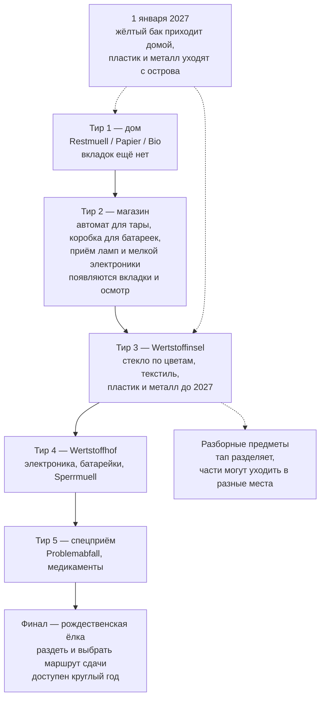
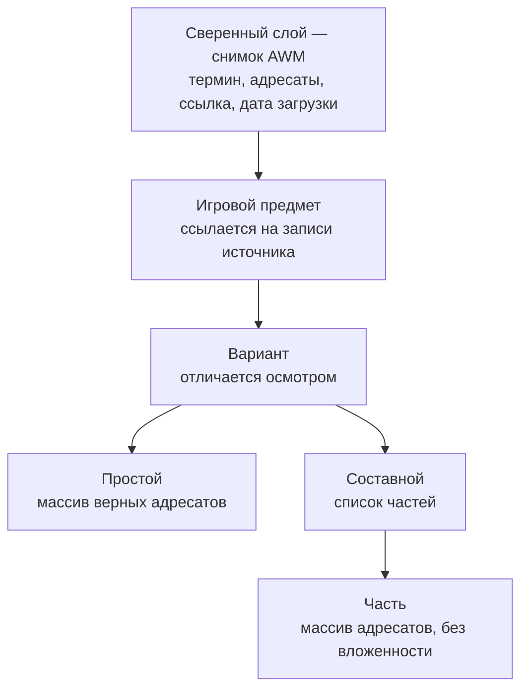

# Munich Waste Sorting Game - Plan

## Goal Capsule

- **Цель.** Мобильная веб-игра, которая учит новоприбывших в Мюнхен не тому, в какой бак, а куда нести — и одновременно служит публичным портфолио-артефактом: постановка задачи, архитектурное решение, UX/UI, вывод в продакшен и сопровождение через смену предметной области 1 января 2027.
- **Продуктовая ответственность.** Документ описывает первый релиз (осень 2026) и январский релиз 2027 как один связный продукт. Акт публикации входит в объём первого релиза; партнёрство с AWM и версии для других городов — нет.
- **Открытые блокеры.** Два, оба в разделе Resolve Before Planning: сколько предметов автор готов честно сверить к целевой дате, и перечень мюнхенских точек входа для публикации.

---

## Product Contract

### Summary

Мобильная веб-игра, где мусор падает сверху, а снизу — один непрерывный ряд контейнеров, сгруппированный по местам: дом, магазин, остров, Wertstoffhof, спецприём. Игрок свайпает ряд или прыгает к нужной группе тапом по вкладке места. Места открываются по одному, повторяя реальную структуру города, а завершает игру рождественская ёлка — единственный предмет, у которого верный ответ вообще не контейнер. 1 января 2027 жёлтый бак приходит домой, а упаковка из пластика и металла уходит с острова — изменением данных, не кода.

### Problem Frame

Мюнхен устроен не так, как остальная Германия, и часть этих отличий переживёт 2027 год, а часть нет. Долгоиграющие: стекло и текстиль сдают на Wertstoffinseln, а не забирают от дома; из трёх домашних баков платный только Restmüll; крупногабарит, электроника и опасные отходы идут через Wertstoffhöfe; Gelber Sack в городе не появляется никогда.

Главная трудность не в том, в какой бак. Четыре бака запоминаются за вечер. Не запоминается то, что **у мусора есть место**: часть выносится во двор, часть возвращается в магазин, часть на остров, часть везётся на Wertstoffhof, часть сдаётся отдельно, а ёлка — вообще на специальную площадку в определённые дни. Приезжий, у которого в прошлом городе всё забирали от дома, ошибается на уровне места, а не контейнера, и никто ему это связно не объясняет: AWM объясняет по предметам, а человеку нужно по местам.

Самое неочевидное из мест — магазин, и оно же самое полезное. Batteriegesetz обязывает любого продавца батареек принимать их назад бесплатно, а ElektroG обязывает магазины сверх порога по площади принимать старые лампы и мелкую электронику до 25 см — без покупки нового. То есть зарядка, ради которой человек собирается ехать через полгорода на Wertstoffhof, кладётся в коробку у кассы, пока он покупает молоко.

Второй слой — **ответ написан на предмете, а не следует из его названия.** Бутылка с надписью Pfand возвращается в автомат, а внешне такая же с надписью Pfandfrei — нет; слово содержит «Pfand», и на этом ловятся. Обёртка чайного пакетика бывает бумажной, а бывает фольгированной, и сам пакетик бывает целлюлозным, а бывает из синтетического нетканого материала — от этого зависит, можно ли его в Bio. Такие предметы надо рассматривать, а не узнавать.

Третий слой — **границы внутри знакомой категории.** Чек из супермаркета на ощупь бумага, но термобумага идёт в Restmüll, и осмотр тут не помогает: чек без фенола внешне неотличим от остальных, поэтому все считаются худшим случаем. Коробка от пиццы — не один ответ, а два: чистый картон в Papier, остатки еды в Bio. Чайный пакетик — четыре: обёртка, сам пакетик, нитка со скобкой, бумажный ярлычок. У йогуртового стаканчика части расходятся не по бакам, а по местам.

Четвёртый слой — заблуждение о санкциях. За бытовую ошибку сортировки в Баварии грозит порядка 20 евро, и на практике санкция обычно другая: бак с примесями вывозят как Restmüll и выставляют счёт. Крупные штрафы относятся к незаконному выбросу — но и там верных маршрутов обычно несколько, и игра, называющая верным один, ошибается не в пользу игрока.

Пятый слой — время. С 1 января 2027 город вводит Gelbe Tonne, баки развозят с ноября 2026, а контейнеры для пластиковой и металлической упаковки с Wertstoffinseln уезжают. Переучиваться будет весь город, и меняется при этом именно место.

### Key Decisions

- KD1. **Обучение важнее геймификации.** Когда развлечение и обучение расходятся, выигрывает обучение: игровая механика существует, чтобы удержать внимание на скучной теме, а не наоборот. Governs R8, R9, R10.
- KD2. **Падающий мусор и свайп-лента контейнеров** (session-settled: user-directed — chosen over ежедневный формат в духе Wordle: лестница мест учит устройству системы, плоский список предметов не учит). Governs R1, R6.
- KD3. **Лента одна и непрерывная, контейнеры в ней сгруппированы по местам** (session-settled: user-directed — chosen over вкладки как переключатель режима: при подмене содержимого игрок теряет ориентир под падающим предметом, а непрерывный ряд едет и ориентир сохраняет. Побочно длина свайпа до дальнего места сама работает метафорой того, что туда далеко ехать). Governs R1, R2, R6.
- KD4. **Вкладки мест — прыжок по ленте, а не смена режима; осмотр и разборка — тап по предмету** (session-settled: user-approved — chosen over вертикальный свайп и пинч: оба конфликтуют с браузерными жестами мобильного веба, пинч недоступен большим пальцем одной руки. Вкладки при этом остаются постоянно видимыми и сами показывают структуру мест). Governs R2, R4, R5.
- KD5. **Единственный финал — рождественская ёлка** (session-settled: user-directed — chosen over парный финал с Октоберфестом: возврат многоразовой посуды на Wiesn не является выбором для посетителя, а площадка мероприятия не входит в модель мест). Governs R7.
- KD6. **Скорость падения зависит от предмета, а быстрый сброс вознаграждается.** Время — ресурс, который тратится только при сомнении; счёт измеряет не память, а понимание того, что ты знаешь. Governs R3, R10.
- KD7. **Данные разделены на сверенный слой и авторский.** Сверенный приходит из AWM и диффается автоматически; авторский — отобранные игровые предметы, которые на него ссылаются. Без этого разделения диф бесполезен, а контент недоказуем. Governs R13, R14, R15.
- KD8. **Правила, состав мест и состав контейнеров живут данными, отдельно от игровой логики.** Единственный способ пережить 1 января 2027 без переписывания — и переход переносит контейнер между местами, а не только меняет адреса. Governs R13, R18, R21.
- KD9. **Универсальность архитектуры не выходит наружу** (session-settled: user-approved — chosen over явный мультигород в интерфейсе: обобщённое не пересылают знакомым). Governs R13.
- KD10. **DE и EN в первом релизе, UK и TR языковым тактом позже** (session-settled: user-directed — chosen over все четыре сразу: вычитка на TR и UK требует носителей, это внешняя зависимость на критическом пути). Governs R21.
- KD11. **Игра не преувеличивает санкции и не сужает верные маршруты.** Ложная угроза штрафом на верном ответе разрушает доверие сильнее любой другой ошибки. Governs R7, R17.
- KD12. **Доступность не полагается на цвет нигде.** Стекло по цветам — единственное место в системе, где цвет несёт адрес, и именно эта пара хуже всего различима при дальтонизме. Governs R12.
- KD13. **Обязательный правовой минимум входит в релиз безусловно, сбор статистики — нет.** Публикация без Impressum и Datenschutzerklärung незаконна независимо от статистики; статистика же — единственное обязательство с внешним контрагентом и первый кандидат на перенос. Governs R25, R26.
- KD14. **Устаревшие сезонные данные показываются с датой, а не скрываются.** Сезонные страницы AWM публикуются не круглый год, и молчание хуже честной пометки. Governs R16.

### Requirements

**Ядро геймплея**

- R1. Предметы падают сверху; внизу горизонтальная лента контейнеров; игрок подводит нужный контейнер под падающий предмет.
- R2. Все открытые контейнеры лежат в одном непрерывном ряду, сгруппированном по местам: дом, магазин, Wertstoffinsel, Wertstoffhof, спецприём. В магазине три адресата — автомат для тары, коробка для батареек, приём ламп и мелкой электроники: одно здание, три назначения. У каждой группы видимый разделитель и подпись, на экране видно окно из нескольких контейнеров, а не весь ряд. Управляют лентой два контрола на одном и том же ряду: свайп двигает по контейнерам — точная наводка, тап по вкладке места прокручивает к началу группы — грубая; прокрутка анимирована, ряд едет, а не подменяется, чтобы игрок не терял ориентир под падающим предметом. Ряд вкладок виден постоянно, перечисляет все открытые места и лежит непосредственно над лентой, в нижней трети экрана, вне зоны падения. С клавиатуры: стрелки влево-вправо двигают ленту, Tab и Shift+Tab — на место, цифра по номеру места — сразу к нему. Стрелка двигает именно ленту, а не выбор: видимого курсора нет, прицел неподвижен, и клавиша обязана совпадать по направлению со свайпом.
- R3. Предмет может нести признак «пограничный»: такой падает заметно медленнее остальных и визуально выделен. Предмет, верное место которого отличается от активного, падает медленнее в любом случае — смена места требует дополнительного действия под таймером.
- R4. Предмет может нести признак «требует осмотра»: его верный адрес определяется тем, что написано или видно на самом предмете, а не его названием. На лету надпись принципиально нечитаема; тап останавливает падение и показывает её крупно и разборчиво. Осмотр — действие с ценой во времени, а не подсказка.
- R5. Предмет может нести признак «разборный», независимый от предыдущих: такой нельзя отправить целиком. Тап разделяет его на части, дальше каждая часть сортируется отдельно и может уходить в контейнер другого места. Порядок сортировки частей не имеет значения.
- R6. Игра растёт по пяти тирам, каждый из которых вводит новое место в порядке от частого и близкого к редкому и далёкому: дом → магазин → Wertstoffinsel → Wertstoffhof → спецприём. Первый тир содержит только дом и не показывает ряд вкладок; вкладки появляются вместе со вторым местом. Ранее открытые места остаются доступны.
- R7. После пятого тира игрок проходит финал «Ёлка»: раздевает дерево и выбирает маршрут сдачи. Маршрут — отдельное измерение данных: у каждого свои границы доступности либо признак круглогодичности, своё правило подготовки дерева и свои ограничения. Верными засчитываются все действующие маршруты; illegale Müllablagerung показывается только для места вне любого из них. Финал доступен круглый год.
- R8. После каждого ответа игра показывает объяснение, прежде чем продолжить: верный адрес и причину. Когда ошибка в выборе места, а не контейнера, объяснение адресует место. Когда верных адресов несколько, объяснение называет остальные, даже если ответ был верным.
- R9. Составной предмет оценивается по частям: верно отправленная часть засчитывается, неверная объясняется. Разборка никогда не приносит меньше очков, чем отправка того же предмета целиком.
- R10. Игрок может сбросить предмет досрочно и получает за это больше очков. Ошибка при досрочном сбросе стоит дороже обычной. Пропустить объяснение можно, но за это не награждают: скорость влияет на счёт только до ответа.
- R11. После неверного ответа игра не блокирует прогресс: тир засчитывается по доле верных, а не требует безошибочного прохождения.
- R12. Цвет никогда не единственный носитель смысла. Независимый от цвета сигнал обязателен для контейнеров, для выделения пограничных предметов и для самих падающих предметов, чей верный адрес определяется цветом — в первую очередь для стекла.

**Данные и достоверность**

- R13. Данные разделены на два слоя. Сверенный слой — снимок записей AWM: термин, адресаты, ссылка на источник, дата загрузки. Авторский слой — отобранные игровые предметы, каждый из которых ссылается на записи сверенного слоя. Правила сортировки, состав мест и состав контейнеров каждого места хранятся отдельно от игровой логики; город присутствует в данных как параметр и не отображается в интерфейсе как выбор.
- R14. Игровой предмет описывается как: предмет → варианты → каждый вариант либо простой с массивом верных адресатов, либо составной со списком частей, у каждой из которых свой массив адресатов. Вложенность запрещена: часть не имеет собственных вариантов и собственных частей. Предмет, требующий двух уровней, разбивается на два игровых предмета. Ни один адресат не хранится копией — он выводится из ссылки на запись сверенного слоя.
- R15. Предмет попадает в игру только после того, как человек открыл и прочитал запись-источник; в данных остаётся отметка о ручной проверке с датой. Автоматическая сверка подтверждает, что заявленные адресаты не разошлись с источником, но не заменяет чтение. Контент, не прошедший ручную проверку, в сборку не попадает.
- R16. Когда актуальная редакция сезонных данных ещё не опубликована, игра использует последнюю сверенную редакцию, показывает её год и дату сверки и отправляет игрока за текущим перечнем на сайт AWM. Скрывать контент из-за отсутствия свежей редакции нельзя; выдавать устаревшую за текущую — тоже.
- R17. Игра сообщает о денежных последствиях только там, где они реальны, и разделяет бытовую ошибку сортировки и незаконный выброс.

**Переход на Gelbe Tonne**

- R18. 1 января 2027 жёлтый бак появляется среди контейнеров места «дом», а оба контейнера упаковки — пластик и металл — исчезают из места «Wertstoffinsel», где остаются стекло и текстиль; предметы, сменившие адрес, оцениваются по новому правилу. Всё выполняется изменением данных, без правки игровой логики.
- R19. На протяжении переходного периода игра в начале каждой сессии показывает сообщение о том, что правила изменились, какие предметы сменили место, и что делать до появления жёлтого бака во дворе. Сообщение читается без знания прежних правил: сначала называется действующее правило, затем — что и на что сменилось. Никакой отметки о показе на устройстве не сохраняется.
- R20. Вводный текст игры обновляется вместе с правилами: описание системы города не должно пережить смену, которую оно описывает.

**Локализация и читаемость**

- R21. Тексты интерфейса и контент правил разделены; добавление языка не требует изменения кода. Первый релиз — DE и EN.
- R22. Подписи интерфейса — вкладки мест, названия контейнеров, объяснения — читаются на телефоне на расстоянии вытянутой руки. Это ограничение проверяется вместе с локализацией: длинные немецкие названия мест и минимальный кегль конкурируют за одну ширину экрана. Требование не распространяется на надписи на предметах из R4, чья нечитаемость на лету намеренна.

**Охват, правовой минимум и наблюдаемость**

- R23. Пройденная игра даёт результат, пригодный к пересылке одним действием, без регистрации; результат не содержит идентификатора отправителя, сессии или устройства.
- R24. Первый релиз считается выпущенным только после акта публикации по списку мюнхенских точек входа. Каждая точка публикуется отдельной ссылкой с меткой источника; для каналов с модерацией публикация засчитывается по факту отправки, а не одобрения.
- R25. Собираются события: доходимость до каждого тира, ошибки по каждому предмету с различением ошибки места и ошибки контейнера, доля досрочных сбросов и доля ошибок среди них, источник перехода, завершение финала и факт вызова пересылки результата. Клиентский код не сохраняет в устройстве игрока никакой информации и не читает уже сохранённую — ни cookie, ни localStorage, sessionStorage или IndexedDB, ни отпечаток из характеристик устройства и браузера; собирается только то, что браузер передаёт в самом запросе, IP усекается на приёме. Обработчик размещён в ЕС по договору обработки. Источник перехода определяется меткой из R24, домен реферера — запасной сигнал; ни метка, ни событие пересылки не содержат идентификатора игрока, сессии или устройства, и факт пересылки не связывается с фактом открытия. Сырые события хранятся не дольше 90 дней, агрегированные показатели — бессрочно.
- R26. Продукт публикует Datenschutzerklärung и Impressum, доступные с любого экрана. Содержание уведомления не уже объёма Art. 13 DSGVO — ответственное лицо и контакт, цели и правовое основание, категории получателей, срок хранения, права субъекта и право на жалобу в надзорный орган; поверх этого минимума называются конкретный перечень собираемых событий и срок хранения из R25.

### Progression ladder

### Data model

Пример: коробка от пиццы — один предмет с двумя вариантами. Чистая — простой вариант с адресатом Papier. С остатками — составной, части «картон» и «остатки», адресаты Papier и Bio. Какой из двух вариантов перед игроком, видно только при осмотре.

### Key Flows

- F1. Обычный уровень
  - **Триггер:** игрок открывает тир.
  - **Шаги:** предметы падают по одному; игрок при необходимости тапает вкладку нужного места, затем свайпает ленту; может сбросить досрочно ради очков; после приземления показывается объяснение.
  - **Итог:** тир засчитан по доле верных ответов, новое место открыто и доступно наравне с прежними.
  - **Covers R1, R2, R3, R6, R8, R10, R11, R12.**

- F2. Осмотр
  - **Триггер:** падает предмет с признаком «требует осмотра».
  - **Шаги:** игрок тапает; падение останавливается, надпись или материал показываются крупно; игрок возвращается к сортировке.
  - **Итог:** вариант предмета опознан, дальше обычная сортировка.
  - **Covers R4.**

- F3. Разборка
  - **Триггер:** падает предмет с признаком «разборный».
  - **Шаги:** игрок тапает, предмет распадается на части; каждая часть сортируется отдельно, при необходимости со сменой места.
  - **Итог:** засчитано по частям; неверные части объяснены.
  - **Covers R2, R5, R9.**

- F4. Финал «Ёлка»
  - **Триггер:** пройден пятый тир.
  - **Шаги:** игрок снимает с дерева украшения, подставку и пластик; выбирает маршрут сдачи; выполняет условия выбранного маршрута. Если актуальный перечень мест не опубликован, игра показывает последний сверенный с его годом и ссылкой на сайт AWM.
  - **Итог:** игра пройдена; результат готов к пересылке.
  - **Covers R7, R16, R17, R23.**

- F5. Миграция 1 января 2027
  - **Триггер:** наступает 1 января 2027.
  - **Шаги:** данные правил переключаются на новую редакцию; жёлтый бак приходит домой, контейнеры пластика и металла уходят с острова; вводный текст обновляется; на протяжении переходного периода в начале каждой сессии показывается сообщение об изменении.
  - **Итог:** игра работает по новым правилам и с новым составом мест без правки игровой логики.
  - **Covers R13, R18, R19, R20.**

- F6. Сверка контента
  - **Триггер:** плановый перезапуск снимка, либо новость об изменении правил.
  - **Шаги:** скачивается свежий снимок AWM; сравнивается с предыдущим; изменившиеся записи попадают в список на пересверку; человек открывает источник, подтверждает или правит игровой предмет и обновляет дату ручной проверки.
  - **Итог:** ни один предмет в игре не расходится с источником.
  - **Covers R13, R15.**

### Acceptance Examples

- AE1. **Covers R2, R3, R8.** Дано: в третьем тире активно место «дом», падает стеклянная бутылка. Тогда бутылка падает медленнее, потому что её место отличается от активного, а вкладка «Wertstoffinsel» видна на экране всё это время; когда игрок отправляет бутылку в домашний контейнер — засчитывается ошибка, и объяснение говорит про место, а не про бак.
- AE2. **Covers R4, R14.** Дано: падают две внешне одинаковые бутылки, на одной мелким шрифтом `Mehrweg · Pfand`, на другой `Pfandfrei`. На лету надпись нечитаема; тап показывает её крупно. Первая идёт в автомат для тары в магазине, вторая — по материалу на Wertstoffinsel. Ответ, данный без осмотра, засчитывается по общим правилам, но объяснение называет, чем варианты отличались.
- AE3. **Covers R4, R5, R14.** Дано: падает коробка от пиццы. Осмотр показывает, есть ли на ней остатки. Чистая отправляется целиком в Papier. С остатками — разбирается тапом, картон в Papier, остатки в Bio.
- AE4. **Covers R2, R5, R9.** Дано: падает йогуртовый стаканчик с фольгой и бумажной манжетой. Полная разборка требует смены места: манжета в домашний Papier, стаканчик в пластиковую упаковку, фольга в металл на Wertstoffinsel — три части на два места. Когда игрок отправил манжету верно, а стаканчик нет — засчитывается часть, а ошибочная часть объясняется.
- AE4b. **Covers R2, R8.** Дано: падает старая зарядка от телефона. Верны оба адреса — и магазин, и Wertstoffhof: магазины сверх порога по площади принимают мелкую электронику до 25 см без покупки. Любой выбор засчитывается, а объяснение называет второй, потому что весь смысл этого предмета в том, что ехать через полгорода было не обязательно.
- AE5. **Covers R8.** Дано: падает предмет, у которого в источнике несколько верных адресатов — например, Wertstoffhof, Restmüll и Sperrmüllabholung. Когда игрок выбирает любой из них — ответ верный, и объяснение всё равно называет остальные.
- AE6. **Covers R10.** Дано: игрок сбрасывает предмет досрочно. При верном ответе он получает больше очков, чем за ответ в обычном темпе; при неверном теряет больше, чем при обычной ошибке. Быстрое закрытие экрана объяснения на счёт не влияет.
- AE7. **Covers R7, R17.** Дано: игрок в финале выбирает маршрут сдачи. Когда он везёт измельчённое дерево на Wertstoffhof — засчитывается верно независимо от даты. Когда относит целое дерево на обозначенную Sammelstelle внутри её окна — засчитывается верно. Когда оставляет дерево вне любого действующего маршрута — игра показывает, что это illegale Müllablagerung, и называет размер реального штрафа.
- AE8. **Covers R16.** Дано: игрок открывает финал в июле, когда сезонная страница AWM не опубликована. Тогда игра показывает перечень мест прошлого сезона, называет его год и дату сверки и даёт ссылку на страницу AWM.
- AE9. **Covers R15.** Дано: в данных появился предмет без отметки о ручной проверке. Тогда сборка его не включает, а процесс сборки сообщает, какой предмет и почему исключён.
- AE10. **Covers R18, R19.** Дано: игрок открывает игру внутри переходного периода после 1 января 2027. Тогда он в начале сессии видит сообщение, которое сначала называет действующее правило, затем — что и на что сменилось, и что делать до появления бака во дворе; дома есть жёлтый бак, с острова исчезли оба контейнера упаковки. Повторный вход в новой сессии показывает сообщение снова.
- AE11. **Covers R12, R22.** Дано: игрок не различает цвета и держит телефон на расстоянии вытянутой руки. Тогда контейнеры для стекла и сами падающие бутылки распознаются по независимому от цвета признаку, а подписи вкладок и контейнеров читаются без приближения.
- AE12. **Covers R21.** Дано: в игру добавляется третий язык. Тогда изменения затрагивают только файлы текстов и данных правил; сборка игровой логики не меняется.
- AE13. **Covers R24.** Дано: игра опубликована по списку точек входа. Тогда каждая опубликованная ссылка несёт собственную метку источника, а для канала с модерацией акт публикации засчитан в момент отправки материала.
- AE14. **Covers R25, R26.** Дано: игрок прошёл игру целиком и переслал результат. Тогда в устройстве нет ни одной записи; событие пересылки записано как агрегатный счётчик без идентификатора; Datenschutzerklärung и Impressum открываются с любого экрана, а перечень собираемых событий в уведомлении совпадает с перечнем из R25.

### Success Criteria

- Публичный запуск состоялся внутри окна Октоберфеста 2026: целевая дата — 19 сентября, крайняя граница окна внимания — 4 октября.
- Игра продолжает работать после 1 января 2027 без правки игровой логики при переключении правил и переносе контейнера между местами.
- Переключение зафиксировано публично: до и после видно на скриншотах мест «дом» и «Wertstoffinsel».
- Есть измеримый охват: переходы из внешних источников с различением точек входа, доля прошедших до конца, доля переславших результат.
- Каждый игровой предмет прослеживается до записи AWM и несёт отметку о ручной проверке с датой.
- Доля досрочных сбросов среди верных ответов растёт от первого прохождения ко второму — признак того, что игрок начал знать, а не угадывать.

### Scope Boundaries

**Отложено на потом**

- Ежедневный формат «предмет дня» как канал раздачи.
- Украинский и турецкий языки.
- Расширение покрытия за пределы пяти мест и одного финала.
- Отдельный тренировочный режим для отработки разборных предметов вне прохождения.
- Дополнительные финалы.
- Карта с координатами реальных островов и Wertstoffhöfe: данные для неё лежат на открытом портале города, но в первом релизе места абстрактны.

**Вне идентичности продукта**

- Аккаунты, лидерборды, монетизация.
- Плоская лента со всеми контейнерами сразу: место — часть ответа, а не деталь вёрстки.
- Зеркало Abfalllexikon: игра работает на отобранном наборе, а полный снимок служит сверке и поиску материала. Справочник у AWM уже есть и он лучше.
- Финал «Октоберфест»: возврат многоразовой посуды не является выбором для посетителя Wiesn, а площадка мероприятия не входит в модель мест.
- Явный выбор города в интерфейсе: параметризация живёт в данных, продукт снаружи — про Мюнхен.
- Измерение индивидуального образовательного результата игрока: тестов до и после нет, успех продукта меряется охватом. Это про измерение, а не про проектирование — при конфликте механик выигрывает обучение, см. KD1.

### Dependencies / Assumptions

- Приём в магазине опирается на федеральный закон, а не на AWM, поэтому у него отдельный источник: Batteriegesetz обязывает любого продавца батареек принимать их назад бесплатно, ElektroG обязывает магазины с торговой площадью от 400 м² — и продуктовые от 800 м², если они регулярно продают электротовары — принимать старые лампы и мелкую электронику до 25 см без покупки. Эти две нормы и есть основание магазина как места; сверяются они по законодательству, а не по Abfalllexikon.
- AWM остаётся публично доступным источником истины. Индексная страница Abfalllexikon отдаётся без JavaScript и содержит около 700–1000 записей вида «термин → адресаты», у части записей есть отдельные страницы деталей.
- Лексикон — база данных, а базы в Германии защищены отдельно (§87a UrhG): отдельные факты не охраняются, систематическое извлечение существенной части может. Снимок хранит классификацию и ссылки, а не тексты AWM. До широкой публикации имеет смысл запросить у AWM разрешение — это же первый контакт с потенциальным усилителем.
- Маршрутов сдачи ёлки несколько. Редакция 2026: Wertstoffhöfe принимают до 20 измельчённых деревьев бесплатно круглый год и названы первым адресом; открытые Sammelstellen принимают целое раздетое дерево с 7 января по 4 февраля; вывозка от Hausverwaltung платная и идёт с 19 января по 27 февраля по заявке.
- Сезонная страница AWM по ёлкам публикуется только в сезон, поэтому первый релиз выходит с редакцией 2026 и пометкой по R16, а сверка следующей редакции выполняется в декабре 2026.
- Ввод Gelbe Tonne с 1 января 2027 состоится в объявленные сроки. Развоз баков идёт волнами с ноября 2026, окраины раньше плотной центральной застройки, и жёлтый бак не является обязательным к установке.
- Финальный перечень предметов, меняющих место при вводе Gelbe Tonne, AWM опубликует до декабря 2026. Механизм R18 от перечня не зависит.
- Носители украинского и турецкого для вычитки появляются к декабрю 2026; иначе языковой такт сдвигается. На январский релиз это не влияет.
- Impressum по §5 DDG требует ladungsfähige Anschrift; абонентский ящик не подходит. Адрес выбирается и оформляется заранее, чтобы не блокировать акт публикации.
- **Реализацию предполагается делегировать агенту, поэтому связывающее ограничение проекта — не код, а контент.** Механики, вёрстка, слои данных и локализация делегируются хорошо. Сверка каждого предмета с AWM не делегируется вообще: агент уверенно придумает правило сортировки, а городская правота — единственное отличие продукта от десятка существующих. R15 существует именно как барьер против этого. Настройка ощущения — скорости падения, вес сброса, кривая награды — тоже остаётся за автором: она докручивается игрой, а не спекой.
- Спайк на первые два места собран и сыгран: цикл держит внимание, непрерывная лента с вкладками мест работает одной рукой, скорости падения и числа наград выставлены наугад и требуют настройки. Лежит в `prototype/spike-belt.html`.

### Outstanding Questions

**Resolve Before Planning**

- Сколько игровых предметов автор готов честно сверить к целевой дате. Это, а не скорость сборки, определяет достижимость 19 сентября: механики делегируются, чтение источников — нет. Из цифры выводится и объём контента, и то, сколько тиров попадает в первый релиз.
- Перечень мюнхенских точек входа для R24. Требование делает акт публикации условием выпуска, но список каналов нигде не назван, а от него зависят и лаг на модерацию, и метки источника в R25.

**Deferred to Planning**

- Какой тир режется первым, если объём не укладывается: приоритетный порядок внутри требований.
- Считается ли промах по месту отдельным типом ошибки в счёте, или он равен промаху по контейнеру.
- Насколько дороже ошибка при досрочном сбросе и насколько ценнее верный досрочный ответ — числа кривой награды.
- Сколько контейнеров помещается в видимом окне ленты на телефоне так, чтобы соседние группы были различимы, но подписи оставались читаемыми при минимальном кегле.
- Как места и контейнеры визуально идентифицируются — иконка, подпись или комбинация — при минимальном кегле и четырёх языках.
- Технический стек и формат хранения авторского слоя данных.
- Форма пересылаемого результата, и не создаёт ли она серверной записи о конкретной пересылке.
- Какой обработчик статистики в ЕС выбирается и подтверждено ли, что его клиентский код не читает характеристики браузера сверх передаваемых в запросе.
- Кто выступает ответственным лицом по DSGVO — физическое лицо автора или юридическое лицо.
- Как определяется наступление переходного периода и его окончание, и по какому источнику времени.
- С какой периодичностью запускается сверка по F6 и кто её инициирует.

### Sources / Research

- AWM Abfalllexikon — источник по каждому предмету: `https://www.awm-muenchen.de/abfall-entsorgen/abfalllexikon`
- Устройство мюнхенской системы, три бака и Wertstoffinseln: `https://www.awm-muenchen.de/entsorgen/das-muenchner-muellsystem`
- Что реально стоит на Wertstoffinsel — стекло по цветам, отдельно пластиковая упаковка, отдельно металл, и что стекло остаётся после 2027: `https://www.awm-muenchen.de/abfall-entsorgen/abgabestellen/wertstoffinseln`
- Проект Gelbe Tonne, сроки и параметры: `https://www.awm-muenchen.de/unternehmen/projekte/gelbe-tonne`
- FAQ по Gelbe Tonne, включая замену контейнеров на Wertstoffinseln и необязательность бака: `https://www.awm-muenchen.de/unternehmen/projekte/gelbe-tonne/faq-gelbe-tonne`
- Решение о вводе с 2027 года: `https://ru.muenchen.de/2026/85/Einfuehrung-der-Gelben-Tonne-nimmt-naechste-Huerde-124132`
- Маршруты сдачи рождественских ёлок, места и окна: `https://www.awm-muenchen.de/abfall-entsorgen/abgabestellen/christbaumentsorgung`
- Wertstoffinseln и Wertstoffhöfe как открытые датасеты с координатами: `https://opendata.muenchen.de/dataset/awm_container_opendata` и `https://opendata.muenchen.de/dataset/awm_wertstoffhoefe_opendata`
- Размеры штрафов в сфере обращения с отходами: `https://www.bussgeld-info.de/muell-muellentsorgung/`
- Конкурентное поле обучающих игр про сортировку: #wirfuerbio Sortierspiel, Die Müll AG (Карлсруэ), браузерные сортировки на plays.org — все ориентированы на детей и обобщённую Германию, городской специфики нет.
- Спайк, первые два места на непрерывной ленте: `prototype/spike-belt.html`
- Снимок и диф лексикона: `tools/awm_lexikon.py`
