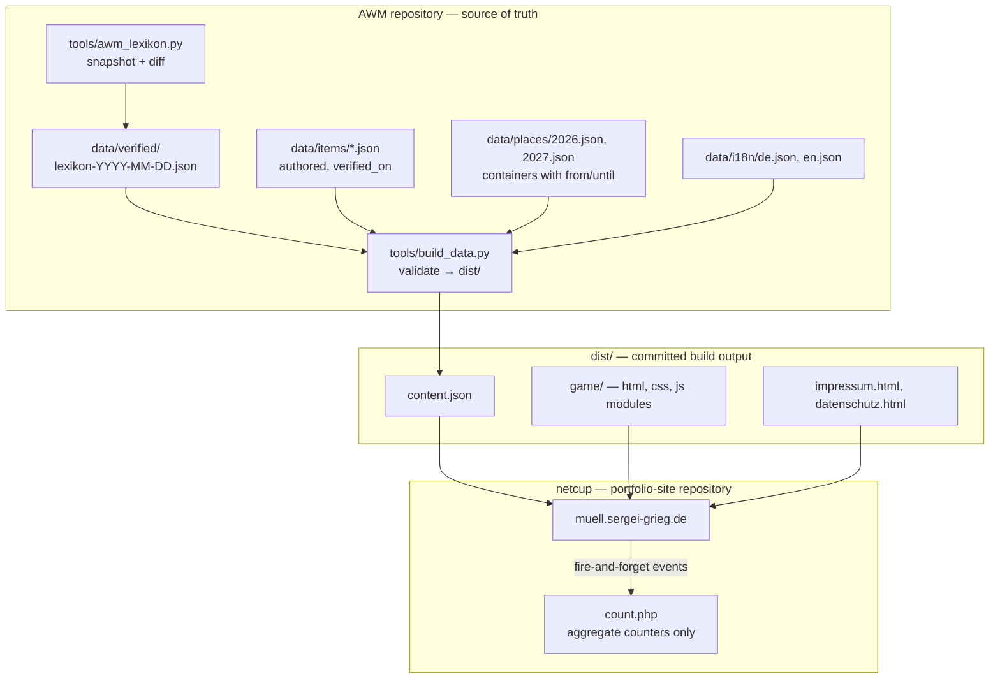
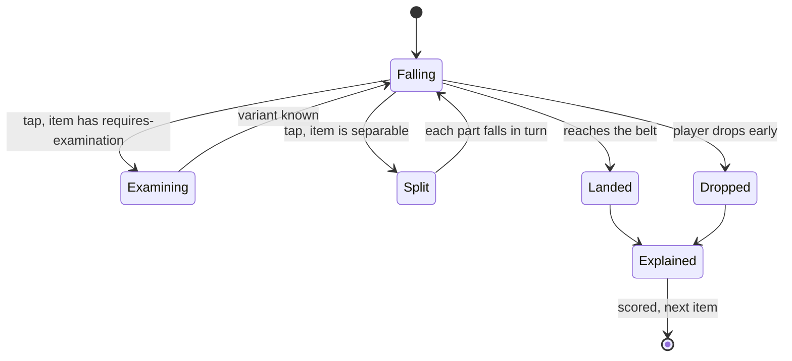
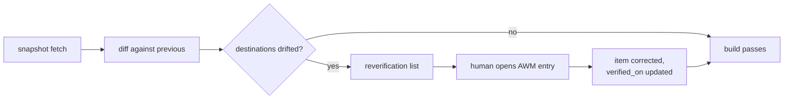

# Munich Waste Sorting Game - Implementation Plan

How the product described in [docs/SPEC.md](../SPEC.md) gets built, verified and published between 23 August and 19 September 2026. Requirement IDs (R), flows (F) and acceptance examples (AE) are the origin's; this document adds technical decisions (KTD) and implementation units (U).

**Product Contract preservation:** unchanged. No requirement was rewritten, split or reinterpreted. Both Resolve-Before-Planning blockers were answered by the author on 23 August 2026 and are recorded under Planning Contract.

---

## Goal Capsule

- **Objective.** Ship a mobile-web game that teaches newcomers to Munich *where to carry* household waste, published to Munich entry points inside the Oktoberfest attention window, and built so the Gelbe Tonne switch on 1 January 2027 is a data change.
- **Deadline arithmetic.** 27 days from this plan to the 19 September target; 4 October is the outer edge. Code is not the constraint — verified content and the legal minimum are.
- **Binding constraint.** R15: nothing enters the build that a human has not read at its AWM source. The build enforces this rather than trusting it.

---

## Planning Contract

### Blockers, now answered

- **How many items get hand-verified before the target date.** Author's answer: as many as the game needs, up to ~200 — volume is not the constraint. Consequence: the full five-tier ladder (R6) is in the first release, no tier is pre-cut, and the content pipeline is built to absorb items continuously rather than in one batch. The cut order in Risks stays as insurance against calendar, not willingness.
- **Which Munich entry points make up R24.** Author's answer: Reddit (r/Munich, r/Muenchen) and expat communities (Toytown Germany, Facebook newcomer groups, Telegram chats). Each gets its own source tag per R25; for moderated channels publication counts on submission (R24).

### Assumptions carried into implementation

- The game is served from the existing netcup host out of the `portfolio-site` repository, so PHP is available and no build step runs on the server (`git pull` deploys whatever is committed).
- The author performs every AWM verification personally. No agent-authored sorting rule enters `data/items/`.
- Fall speeds, the reward curve and the size of the early-drop bonus are tuned by playing, not by specifying. This plan sets starting values and marks them as tuning targets.

---

## Key Technical Decisions

- **KTD1. Vanilla ES modules, no framework, no build step for code** (session-settled: user-approved — the address and hosting answer implies it). The spike already runs this way; the server does a bare `git pull`; a single-screen game with a 60fps fall loop gains nothing from a component runtime and loses the ability to be debugged by opening one file. Governs U3.
- **KTD2. Content is built, code is not.** `tools/build_data.py` validates the authored layer against the verified snapshot and emits `dist/`. Unverified items are excluded and named in the build report (R15, AE9). This is the only build step, it runs locally, and its output is committed. Governs U1, U2.
- **KTD3. Nothing is stored on the device — at all.** R25 forbids cookie, localStorage, sessionStorage, IndexedDB and derived fingerprints. Consequence beyond analytics: tier unlocks, score and the R19 transition message live in memory for the duration of one run. A reload starts over, and that is correct behaviour, not a defect. Governs U5, U6, U10, U12.
- **KTD4. Analytics is a self-hosted PHP counter on netcup, not an external processor** (session-settled: user-directed — chosen over Plausible/Matomo: both count unique visitors by hashing IP with User-Agent, which is exactly the device-derived identifier R25 forbids; self-hosting also removes the release's only external counterparty, the risk KD13 names). Only aggregate counters are stored; the IP is truncated on receipt and never written. Governs U12, U13.
- **KTD5. The rules edition is resolved on the client from the data's own validity windows.** Containers and places carry `from` / `until` dates; the engine picks the edition from the current date. The 1 January 2027 switch therefore needs no deploy and no code edit (R18), and the transition message (R19) is driven by the same window. Trade-off: a device with a wrong clock sees the wrong edition — accepted, since the alternative is a server round-trip on a page that must work as a static file. Governs U10.
- **KTD6. Published at `muell.sergei-grieg.de`** (session-settled: user-directed — chosen over a path under the portfolio and over a new domain: the subdomain pattern already works for `cinema.sergei-grieg.de`, and a short address matters for a result that gets forwarded (R23) and pasted into Reddit threads (R24)). The files live in the `portfolio-site` repository; the AWM repository stays the source. Governs U14.
- **KTD7. Place errors and container errors are distinct types end to end.** They differ in the explanation (R8), and R25 requires them to be counted separately. They cost the same points — the product's claim is that place is the hard part, not that it is worth more. Governs U5, U12.
- **KTD8. Source tags never survive the first paint.** The referral tag is read from the URL, counted once, then removed with `history.replaceState` so a forwarded link does not carry the sender's entry point (R23, R25). Governs U11, U12.

---

## High-Level Technical Design

### Components



### One item's lifecycle



### Verification loop



---

## Output Structure

```text
data/
  verified/lexikon-2026-08-23.json     snapshot, produced by tools/
  items/<id>.json                      authored items, one file each
  places.json                          places and containers with validity windows
  finale/christbaum-2026.json          routes, windows, preparation rules
  i18n/de.json  i18n/en.json           interface strings
game/
  index.html
  css/game.css
  js/main.js belt.js fall.js item.js score.js explain.js
  js/rules.js i18n.js share.js analytics.js finale.js
server/
  count.php                            aggregate counters, no identifiers
legal/
  impressum.html  datenschutz.html     templates with {{PLACEHOLDERS}}
  values.example.json                  the keys; values.local.json is git-ignored
tools/
  awm_lexikon.py                       snapshot and diff (exists)
  build_data.py                        validate authored layer, emit dist/
  render_legal.py                      substitute personal details into dist/
  publish.py                           copy dist/ into portfolio-site
dist/                                  build output, committed
```

---

## Implementation Units

### U1. Data schema and the build gate

- **Goal.** The shape of the authored layer, and a build that refuses to ship anything unverified.
- **Requirements.** R13, R14, R15, AE9.
- **Dependencies.** None.
- **Files.** `data/places.json`, `data/items/_example.json`, `tools/build_data.py`, `tools/test_build_data.py`.
- **Built. Deviations from this unit as first written, each deliberate.** The shape is enforced by `tools/build_data.py` rather than by JSON Schema documents: the toolchain is standard library only, so a schema file would need a hand-written interpreter beside it and the two would drift. `data/items/_example.json` carries the shape by example. Places live in a single `data/places.json` with per-container validity windows rather than one file per edition — a file per edition would need a deploy on 1 January 2027, which contradicts KTD5.
- **Approach.**
  1. Item shape: `id`, `tier`, `attrs` (`borderline`, `examine`, `separable`), `variants[]`, `source` (`key`, `url`, `verified_by`, `verified_on`), `explanation` per language.
  2. A variant is either `simple` with `destinations[]` or `composite` with `parts[]`; a part carries `destinations[]` and nothing else. Nesting is rejected by the validator, not by convention (R14).
  3. Destinations are never literals — each resolves to a container id declared in `data/places.json`, and a destination may carry its own `from` / `until`, which is how one item survives the 2027 switch without a second copy of itself.
  4. Drift is detected by comparing snapshots, not by comparing the game to AWM: the item records `source.destinations_at_verification`, what the snapshot said when the human read it, and the build excludes the item when the current snapshot disagrees. This leaves the game's own destination vocabulary free, which matters because the shop rests on the Batteriegesetz and the ElektroG rather than on AWM — those items carry `authority: law` with the norm instead of a lexicon key.
  5. The gate: no `verified_on`, no `verified_by`, a verification dated in the future, a `source.key` missing from the snapshot, or drifted destinations excludes the item and prints why.
- **Patterns to follow.** `tools/awm_lexikon.py` — standard library only, Russian operator-facing messages, exit code carries meaning.
- **Test scenarios.**
  - Covers AE9. An item without `verified_on` is excluded and the report names it and the reason.
  - An item whose `source.key` is absent from the snapshot is excluded.
  - An item whose declared destinations differ from the snapshot's is excluded as drifted, and the message shows both sets.
  - A composite variant whose part itself carries `variants` fails validation with a message naming the nesting rule.
  - A destination id absent from `data/places/` fails validation.
  - A valid item survives the build and appears in `dist/content.json`.
  - An item whose only destination retires on 1 January 2027 builds today with a warning naming that date, and is excluded when the build date is after it.
  - An item whose destinations carry windows on both sides of the switch builds clean on both dates.
- **Verification.** `python3 tools/build_data.py` on a fixture directory containing one valid and five broken items emits exactly one item and five named exclusions.

### U2. Verification workflow and the first tier of content

- **Goal.** A repeatable way for a human to turn an AWM entry into a verified item, and the first tier's worth of items produced through it.
- **Requirements.** R13, R15, R16, R17, AE1, AE3.
- **Dependencies.** U1.
- **Files.** `docs/VERIFYING.md`, `data/items/*.json`, `data/verified/lexikon-2026-08-23.json`.
- **Approach.**
  1. `docs/VERIFYING.md` states the loop: open the AWM entry, read it, record destinations, copy the URL, stamp `verified_on`, run the build.
  2. Start from the snapshot's counter-intuitive entries — AWM's own `tip` field flags several (the receipt entry carries "blue to paper, white thermal to Restmüll" verbatim).
  3. Tier one is home: Restmüll, Papier, Bio. Target 8 items, at least two of them borderline.
  4. Explanations are written per item in German and English at authoring time, not generated later.
- **Execution note.** Content lands continuously from here to launch; this unit delivers the first tier and the workflow, not the whole corpus.
- **Test scenarios.**
  - Every file in `data/items/` passes U1's validator.
  - Covers AE1. A glass bottle authored for tier three carries a destination outside `home`, so the engine can slow it when the active place differs.
  - Covers AE3. The pizza box exists as one item with a clean simple variant and a composite variant with residue.
  - Spot check: three items picked at random resolve to a live AWM URL that still states the same destinations.
- **Verification.** The build emits at least 8 tier-one items with zero exclusions.

### U3. Engine core — fall, belt, tabs, keyboard

- **Goal.** The spike's loop rebuilt as modules driven by `dist/content.json` instead of inline arrays.
- **Requirements.** R1, R2, R3, R6, R22, F1.
- **Dependencies.** U1.
- **Files.** `game/index.html`, `game/css/game.css`, `game/js/main.js`, `game/js/fall.js`, `game/js/belt.js`, `game/js/item.js`, `game/test/belt.test.html`.
- **Approach.**
  1. Lift `prototype/spike-belt.html` intact where it works: one continuous track, groups with dividers, animated scroll, swipe plus tab jump, arrow keys agreeing in direction with the swipe.
  2. Places and containers come from data; the tab row renders only unlocked places and stays hidden while only `home` exists (R6).
  3. Fall speed per item: base from the item's tier, multiplied down when `borderline`, multiplied down again when the item's correct place differs from the active one (R3).
  4. The visible belt window is a layout constraint, not a constant: at 320 px the player must see the active group plus a hint of the neighbouring one. Starting geometry from the spike — 88 px containers, 10 px gap, 26 px divider.
- **Patterns to follow.** `prototype/spike-belt.html` for the track transform, gesture handling and tab jump.
- **Test scenarios.**
  - A swipe moves exactly one container; a tab tap scrolls to the start of that group with animation rather than replacing content.
  - Left/right arrows move the belt in the same direction as the equivalent swipe; digits jump to the place with that number.
  - An item marked `borderline` takes measurably longer to fall than a plain item of the same tier.
  - An item whose place differs from the active place falls slower than the same item when its place is active.
  - At 320 px width the active group and part of its neighbour are both visible, and container labels are not truncated.
  - With only `home` unlocked, no tab row is rendered.
- **Verification.** The tier-one loop is playable end to end on a phone, driven entirely by `dist/content.json`.

### U4. Examination and separation

- **Goal.** The two taps that make an item more than its name.
- **Requirements.** R4, R5, R14, F2, F3, AE2, AE3, AE4.
- **Dependencies.** U3.
- **Files.** `game/js/item.js`, `game/js/examine.js`, `game/js/split.js`, `game/css/game.css`.
- **Approach.**
  1. `requires examination`: the label is rendered deliberately illegible in flight — small, low contrast, blurred — and a tap halts the fall and shows it large. Halting costs time against the reward curve; it is never a hint about the answer.
  2. `separable`: a tap breaks the item into its parts, which are sorted one at a time in any order, across places where needed.
  3. The two attributes are independent: an item may need examining to learn *which variant* it is, and that variant may be composite.
- **Test scenarios.**
  - Covers AE2. Two identical bottles differ only by a label reading `Mehrweg · Pfand` and `Pfandfrei`; in flight neither is readable, a tap makes both readable, and they resolve to different destinations.
  - An answer given without examining is scored normally, and the explanation still names what distinguished the variants.
  - Covers AE3. The pizza box with residue cannot be sent anywhere whole; a tap yields cardboard and residue.
  - Covers AE4. The yoghurt pot's parts resolve to containers in two different places, and sorting them requires a place change.
  - Parts sorted in reverse order score the same as parts sorted in declaration order.
- **Verification.** Every authored item carrying `examine` or `separable` is playable through its full variant set.

### U5. Scoring, early drop, explanations

- **Goal.** A score that measures knowing rather than remembering, and an explanation after every answer.
- **Requirements.** R8, R9, R10, R11, AE5, AE6, AE15.
- **Dependencies.** U3, U4.
- **Files.** `game/js/score.js`, `game/js/explain.js`, `game/test/score.test.html`.
- **Approach.**
  1. Starting numbers, all tuning targets: correct 100; correct early drop scaled by remaining fall, up to 150; wrong -50; wrong early drop -75. Examining costs only time.
  2. Composite items score per part, with a floor guaranteeing that taking an item apart never scores below sending it whole (R9).
  3. The explanation always renders before the next item: destination and reason; when the mistake was the place, the text addresses the place (KTD7); when several destinations are correct, it names the others even after a correct answer.
  4. A tier clears on a share of correct answers — starting threshold 70% — never on a clean run (R11).
- **Test scenarios.**
  - Covers AE6. A correct early drop scores above a correct answer at ordinary pace; a wrong early drop costs more than an ordinary mistake.
  - Dismissing the explanation quickly changes no score.
  - Covers AE5. An item with three correct destinations accepts any of them and still names the other two.
  - Covers AE15. The charger accepts both the shop and the Wertstoffhof, and the explanation names the one not chosen.
  - Covers R9. A composite item sorted entirely wrongly still scores no lower than the same item sent whole to a wrong destination.
  - A tier at 70% correct clears; at 69% it does not.
- **Verification.** A full tier can be played to a clear and to a fail, with explanations shown for every answer.

### U6. The ladder of places

- **Goal.** Five tiers that unlock one place at a time, in the order the city imposes.
- **Requirements.** R6, R2, F1.
- **Dependencies.** U3, U5.
- **Files.** `game/js/progress.js`, `data/places/2026.json`.
- **Approach.** Tier order is data: home, the shop, Wertstoffinsel, Wertstoffhof, hazardous drop-off. Unlocking a place appends its group to the belt and its tab to the row; earlier places stay available. Progress is in-memory only (KTD3).
- **Test scenarios.**
  - Clearing tier one reveals the tab row for the first time, with two places on it.
  - The shop renders as one place with three destinations — deposit machine, battery box, lamps and small electronics.
  - A place unlocked in an earlier tier is still reachable in a later one.
  - Reloading mid-run returns the player to tier one with no stored state.
- **Verification.** A player can reach the finale from a cold start in one sitting.

### U7. The Christmas tree finale

- **Goal.** The one item whose answer is not a container.
- **Requirements.** R7, R16, R17, F4, AE7, AE8.
- **Dependencies.** U6.
- **Files.** `game/js/finale.js`, `data/finale/christbaum-2026.json`.
- **Approach.**
  1. Strip the tree first — decorations, stand, plastic — then choose a route.
  2. Route is its own data dimension: availability window or year-round flag, preparation rule, limits. Every currently valid route counts as correct.
  3. Illegal dumping is shown only for a location outside every route, and only there is a real fine named (R17).
  4. When the current season's list is unpublished, the last verified edition is shown with its year and verification date plus a link to AWM (R16) — never hidden, never passed off as current.
- **Test scenarios.**
  - Covers AE7. A shredded tree to a Wertstoffhof is correct on any date; a whole stripped tree to a Sammelstelle inside its window is correct; a location outside every route is named as illegal dumping with the real fine.
  - Covers AE8. With the system date in July, the finale shows the 2026 list labelled with its year and verification date and links to AWM.
  - An unstripped tree cannot be routed anywhere.
  - The finale is reachable year-round.
- **Verification.** The finale plays correctly with the system clock set to January and to July.

### U8. German and English

- **Goal.** Two languages at launch, with adding a third costing no code.
- **Requirements.** R21, R22, AE12.
- **Dependencies.** U3, U5.
- **Files.** `game/js/i18n.js`, `data/i18n/de.json`, `data/i18n/en.json`.
- **Approach.** Interface strings and rule content are separate stores. Language is chosen from the browser and switchable in the UI. German is authored first — it is the language of the source material and the longer of the two, so it sets the layout budget.
- **Test scenarios.**
  - Covers AE12. Adding a third language file makes the language selectable with no change to any `.js` file.
  - Every key used by the engine exists in both language files; the build fails on a missing key.
  - The longest German container label fits its container at 320 px without truncation or overflow.
- **Verification.** The whole game plays through in both languages.

### U9. Accessibility and legibility

- **Goal.** Colour never carries meaning alone, and everything reads at arm's length.
- **Requirements.** R12, R22, AE11.
- **Dependencies.** U3, U8.
- **Files.** `game/css/game.css`, `game/js/belt.js`, `data/places/2026.json`.
- **Approach.** Every container carries a glyph and a text label besides its colour; borderline items carry a shape marker, not a coloured glow alone; glass containers and glass items carry the colour as a word and a hatch pattern, because green-versus-brown is exactly the pair colour-blind players lose. Minimum type: 14 px container labels, 16 px tabs.
- **Test scenarios.**
  - Covers AE11. Rendered in greyscale, every container remains distinguishable and every glass item still states its colour.
  - A borderline item is identifiable without colour.
  - No text in the interface renders below 14 px at any supported width.
- **Verification.** A greyscale screenshot of each tier is legible, checked on a physical phone at arm's length.

### U10. The 1 January 2027 switch

- **Goal.** The yellow bin arrives and light packaging leaves the island, without touching game logic.
- **Requirements.** R18, R19, R20, F5, AE10.
- **Dependencies.** U6.
- **Files.** `data/places/2027.json`, `game/js/rules.js`, `data/i18n/*.json`.
- **Approach.**
  1. Containers carry `from` / `until`; `gelbe_tonne` starts 2027-01-01 at `home`, light packaging ends the same day at `wertstoffinsel`, glass and textiles stay.
  2. The transition period is a window in data — 2027-01-01 to 2027-03-31 as the starting value — and the change message opens every session inside it, stating the current rule first and what changed into what, with nothing recorded on the device (KTD3).
  3. The introductory text is versioned alongside the rules so it cannot outlive what it describes (R20).
- **Test scenarios.**
  - Covers AE10. With the clock at 2027-01-15, the yellow bin is at home, light packaging is gone from the island, and the message opens the session; opening a second session shows it again.
  - With the clock at 2026-12-31 the 2026 edition renders unchanged.
  - An item whose destination moved is scored by the new rule after the switch and the old rule before it.
  - No `.js` file changes between the two editions — the switch is a data diff.
- **Verification.** Screenshots of `home` and `Wertstoffinsel` before and after the date, produced by changing only the clock.

### U11. A result worth forwarding

- **Goal.** One action, no registration, nothing identifying.
- **Requirements.** R23, AE14.
- **Dependencies.** U5, U7.
- **Files.** `game/js/share.js`.
- **Approach.** Web Share API where present, clipboard fallback otherwise. The text carries score and tier reached and the bare URL — no session id, no device id, no source tag (KTD8).
- **Test scenarios.**
  - The shared payload contains no identifier of sender, session or device.
  - A link opened with `?src=reddit-munich` and then shared carries a URL without the tag.
  - The clipboard fallback fires where the Share API is absent.
- **Verification.** A shared result opened on another device starts a clean run.

### U12. Aggregate counting

- **Goal.** The R25 event list, measured without touching the player.
- **Requirements.** R24, R25, AE13, AE14.
- **Dependencies.** U5, U6, U7, U11.
- **Files.** `server/count.php`, `game/js/analytics.js`.
- **Approach.**
  1. Events: tier reached; item error with its type, place or container (KTD7); early drop and whether it was correct; referral source; finale completion; share invoked.
  2. The client posts fire-and-forget with no identifiers and reads nothing about the browser. The server increments counters, truncates the IP on receipt and never stores it, sets no cookie.
  3. Only aggregates are kept, so the 90-day raw retention in R25 has nothing to apply to — the privacy notice must say exactly that rather than repeat the requirement's wording.
  4. Referral: the tag from R24's published links, with referrer domain as fallback; the forward event is never linked to the opening event.
- **Test scenarios.**
  - A run produces one counter increment per event with no request carrying an identifier.
  - Covers AE14. The forward event increments an aggregate counter that cannot be joined to any session.
  - `count.php` writes no IP and sets no cookie; a request with a spoofed header changes nothing stored.
  - Covers AE13. Each of the five published entry points produces a distinguishable referral counter.
  - The game plays normally when `count.php` is unreachable.
- **Verification.** A full run against a local PHP server yields the expected counters and an empty cookie jar.

### U13. Impressum and Datenschutzerklärung

- **Goal.** The legal minimum, without which publication is unlawful whether or not anything is measured (KD13).
- **Requirements.** R26, AE14.
- **Dependencies.** U12.
- **Files.** `legal/impressum.html`, `legal/datenschutz.html`, `legal/values.example.json`, `tools/render_legal.py`, `game/index.html`.
- **Approach.** The operator's address, telephone and VAT number are required to be public on the site, but this repository is public and its history is permanent — an address committed today outlives the move that makes it wrong. The pages are therefore templates carrying `{{PLACEHOLDERS}}`; values live in the git-ignored `legal/values.local.json` and are substituted into `dist/` at build time, where an unfilled placeholder fails the build rather than reaching a page. Both pages reachable from every screen. The privacy notice is no narrower than Art. 13 GDPR — controller and contact, purposes and legal basis, recipients, retention, data-subject rights, right to complain — and on top of that names the concrete event list from U12 and states that nothing is stored on the device. The Impressum needs a ladungsfähige Anschrift; a PO box does not qualify.
- **Execution note.** The address is the author's decision and is on the critical path — it blocks publication, not development. The portfolio site currently has neither page, so this work benefits both.
- **Test scenarios.**
  - Both pages open from the start screen, mid-run and from the finale.
  - The event list in the notice matches the events `analytics.js` actually sends — verified by diffing the two lists.
  - Neither page depends on JavaScript to render.
  - A value missing from `values.local.json` fails the render and names the key; no page ships with a visible placeholder.
  - The rendered pages exist only under `dist/`; `git status` after a build shows no personal data.
- **Verification.** A reviewer reaches both documents from any screen in one tap.

### U14. Deployment and the portfolio case

- **Goal.** The game live at its address, and the project readable as work.
- **Requirements.** R24.
- **Dependencies.** U1 through U13.
- **Files.** `tools/publish.py`, `dist/`, and in the `portfolio-site` repository: `muell/`, `src/projects/muell.njk`, `src/_data/projects.json`.
- **Approach.**
  1. `tools/publish.py` copies `dist/` into `portfolio-site/muell/`. It never commits and never pushes — that stays the author's action, per the portfolio repository's own rule.
  2. `muell.sergei-grieg.de` is pointed at that folder in the netcup panel (author's action, outside this repository).
  3. The case page is authored like the existing ones: prose in `src/projects/muell.njk`, metadata in `projects.json`, and the site rebuilt with `npm run build` before committing, because the server has no build step.
- **Test scenarios.**
  - The published folder contains no source data, only `dist/` output.
  - The game loads at the subdomain with no console errors and no network request to any third-party host.
  - `npm run build` in `portfolio-site` leaves no uncommitted diff after the case page is added.
- **Verification.** The address serves the game, and the case appears on the portfolio's Work page.

### U15. Publication

- **Goal.** Shipped, in the R24 sense: published, not merely deployed.
- **Requirements.** R24, R25, AE13.
- **Dependencies.** U14.
- **Files.** `docs/LAUNCH.md`.
- **Approach.** One link per entry point, each with its own source tag: `?src=reddit-munich`, `?src=reddit-muenchen`, `?src=toytown`, `?src=fb-newcomers`, `?src=telegram`. Posts are written per audience in the language that audience reads. For moderated channels, publication counts on submission. `docs/LAUNCH.md` records what was posted where and when, so the referral counters can be read against it.
- **Execution note.** Posting to communities is the author's action, not an automated one — several of these channels treat automated posting as spam, and the first contact with a moderator is worth doing by hand.
- **Test scenarios.**
  - Every published link resolves and carries a distinct tag.
  - Each tag appears in the referral counters within a day of posting.
- **Verification.** All five entry points are recorded in `docs/LAUNCH.md` with dates.

---

## Phased Delivery

| Phase | Days | Units | Outcome |
|---|---|---|---|
| A. Foundation | 24-29 Aug | U1, U2, U3 | Tier one playable from data; the build gate refuses unverified content |
| B. The game | 30 Aug - 8 Sep | U4, U5, U6, U7, U8, U9 | Five tiers and the finale, two languages, colour-independent |
| C. Fit to publish | 9-14 Sep | U10, U11, U12, U13, U14 | The 2027 switch proven, sharing, counters, legal pages, live at the subdomain |
| D. Launch | 15-19 Sep | U15 | Published to all five entry points |

Content authoring (U2's loop) runs continuously across all four phases and is the schedule's real pacing.

---

## Verification Contract

- `python3 tools/build_data.py` exits non-zero when any authored item lacks manual verification, references a missing snapshot key, or contradicts the snapshot.
- `python3 tools/awm_lexikon.py diff --latest` exits non-zero when destinations drifted, producing the reverification list (F6).
- The game plays from cold start to finale on a physical phone, one-handed, in German and in English.
- With the system clock at 2027-01-15 the yellow bin is present, light packaging is gone, and no `.js` file differs from the 2026 run.
- A complete run stores nothing on the device: cookies, localStorage, sessionStorage and IndexedDB are all empty afterwards.
- No network request leaves the page except to `count.php` on the same host.
- Greyscale screenshots of every tier remain playable.

## Definition of Done

- Every item in the build traces to an AWM entry and carries `verified_by` and `verified_on`.
- Five tiers plus the finale are playable; a tier clears on a share of correct answers, not a clean run.
- Impressum and Datenschutzerklärung are reachable from every screen, and the notice's event list matches what the client sends.
- The game is live at `muell.sergei-grieg.de` and published to all five entry points, each with its own source tag, recorded in `docs/LAUNCH.md`.
- The 2027 edition is present in data and provably switches on date alone.

---

## Scope Boundaries

### Deferred for later (from origin)

A Wordle-style daily item; Ukrainian and Turkish; coverage beyond five places and one finale; a separate practice mode for separable items; additional finales; a map with real coordinates.

### Outside this product's identity (from origin)

Accounts, leaderboards, monetisation; one flat belt holding every container; a mirror of the Abfalllexikon; an Oktoberfest finale; an explicit city picker; measuring an individual player's learning outcome.

### Deferred to follow-up work (plan-local)

- Rewriting `tools/awm_lexikon.py` detail parsing to survive an AWM markup change without a silent drop to zero — today it fails loudly, which is enough for launch.
- A scheduled reverification run (F6 cadence): for now the author triggers it, and the December 2026 tree-data check is the first hard deadline.
- Backfilling Impressum and Datenschutz coverage for the portfolio site's own pages, beyond the game's.

---

## Risks and Dependencies

- **Content volume against the calendar.** Mitigation: tiers ship in ladder order, so a shortfall cuts from the top. Cut order if the date is threatened: hazardous drop-off, then Wertstoffhof. The shop is never cut — it is the product's central claim.
- **The Impressum address blocks publication, not development.** It is the only launch dependency with a legal floor and no workaround; resolve it in Phase A even though it is consumed in Phase C.
- **AWM markup changes and the snapshot breaks.** The parser is bound to `eintrag_card` and `wegwerfen_card`; a redesign drops the count to zero and the build says so loudly. Acceptable, because the alternative — a heuristic that keeps producing plausible wrong data — already happened once in this repository.
- **A subdomain is a manual step in the netcup panel** and cannot be done from here.
- **Device clock drives the rules edition** (KTD5). A wrong clock shows the wrong edition to that device only.
- **AWM may object to the project.** The README already commits to complying; the risk is reputational rather than technical, and asking permission before wide publication is on the author's list.

## Open Questions

Deferred to implementation, where seeing the thing decides the answer:

- The reward curve's real numbers, including how much more a wrong early drop should cost. Tuned by playing.
- How many containers fit the visible window at 320 px once German labels are set at 14 px.
- Whether places and containers are identified by icon, label or both, across two languages.
- Whether the transition window's end (2027-03-31 as a starting value) should be shortened once AWM publishes the bin distribution schedule.

## Sources and Research

- Origin requirements: [docs/SPEC.md](../SPEC.md); working history in [docs/plans/](.).
- Verified layer: `data/verified/lexikon-2026-08-23.json`, 549 entries, fetched 23 August 2026.
- Spike whose loop this plan preserves: [prototype/spike-belt.html](../../prototype/spike-belt.html).
- Deployment constraints read from the `portfolio-site` repository: no build step on the server, `git pull` deploys, PHP available, subdomain pattern in use, and neither an Impressum nor a Datenschutzerklärung currently exists.
